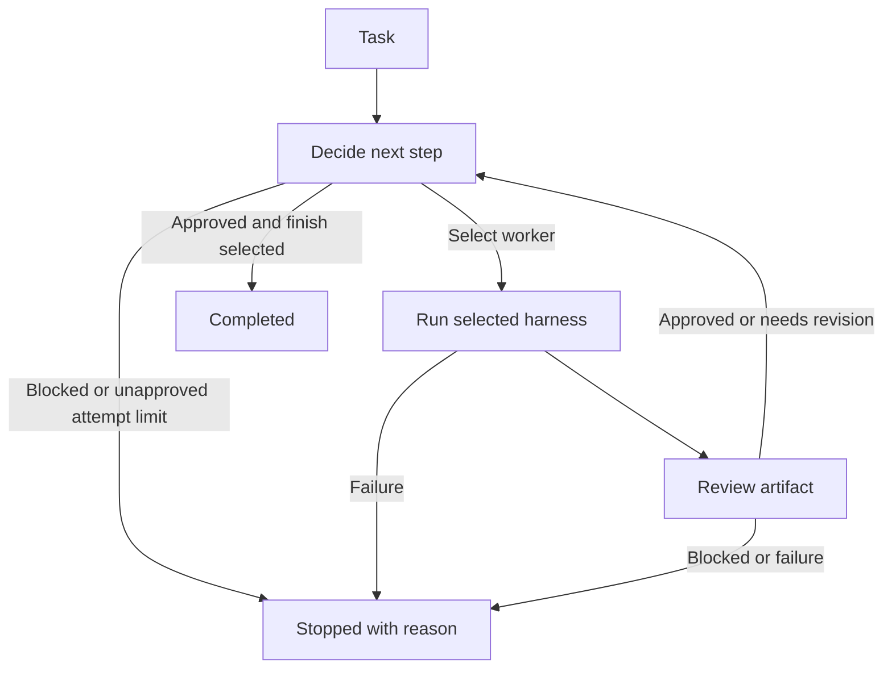

# Hivemind

A fresh **TypeScript terminal app** built on LangGraph, with a basic interactive TUI and scriptable CLI. A router selects the execution route; an orchestrator spawns task workers and coordinates their replies. General and security reviewers independently inspect the same artifact. Both must approve before completion, and either can return findings to the orchestrator for repair.

This is the new workflow foundation. It does not restore the previous Hivemind application.

## Run it

Requires Node.js 22 or newer and npm.

```sh
npm ci
npm run demo
npm run cli -- --task "Write a project introduction"
npm run cli -- --config examples/demo.json --graph
npm run cli -- --config examples/demo.json --task "Write a project introduction" --json
npm run cli -- --config examples/demo.toml --task "Write a project introduction"
```

`--config` accepts both `.json` and `.toml`; the extension selects the parser and the format that setters write back. The shipped `examples/demo.toml` and `examples/multi-harness.toml` mirror their `.json` counterparts.

The demo runs offline without API keys. It deliberately rejects the first draft, revises it, approves the second draft, and finishes. Demo responses are deterministic examples, not live AI results.



Use `--graph` to print Mermaid generated from the actual LangGraph workflow.

The web run visualization shows **Router → selected agents → Reviewer**, with a separate card for each dispatched task/agent. Only selected research, planning, design, or work stages appear, in execution order; same-stage agents fan out and rejoin before the next stage or Reviewer. A worker-only decision is a three-card graph. The Reviewer retains its revise connection to Router, and a Router evaluating the next decision shows no stale agents from the previous attempt. Agent cards share their stage's progress and retry status because the API does not emit individual-agent telemetry; the run's final status is shown outside the graph rather than as another node. A completed run's final attempt row ends with a **Done** chip. Earlier revised attempts and running, failed, blocked, exhausted, or cancelled runs never show that success indicator.

## Configuration files

A config file names the harness registrations, the agents (one reviewer, one or more workers, an orchestrator, a security reviewer, and an optional router agent), the router, and the loop limits. JSON uses the camelCase field names shown elsewhere in this README. TOML uses the same structure with `snake_case` keys — the mapping is mechanical and uniform in both directions (`maxAttempts` ↔ `max_attempts`, `timeoutMs` ↔ `timeout_ms`, `baseUrl` ↔ `base_url`, `apiKeyEnv` ↔ `api_key_env`, `maxTokens` ↔ `max_tokens`, `executableArgs` ↔ `executable_args`, `maxOutputBytes` ↔ `max_output_bytes`), with no per-field exceptions. Harnesses are `[harnesses.<id>]` tables and agents are an `[[agents]]` array of tables.

```toml
max_attempts = 3

[router]
type = "rule"

[harnesses.demo]
type = "demo"

[[agents]]
id = "writer"
role = "worker"
harness = "demo"
description = "Writes and revises the artifact"

[[agents]]
id = "reviewer"
role = "reviewer"
harness = "demo"
description = "Checks the latest artifact"
```

On load, `personas` is accepted as an alias for the `agents` array (compatibility with the `hivemind.toml` shape), but agents are always serialized back as `agents`. Run the TOML example:

```sh
npm run cli -- --config examples/demo.toml --task "Write a project introduction"
```

The TOML is deliberately `hivemind.toml`-style (snake_case, `[[agents]]`), but it is **not** field-for-field compatible with the Rust backend's config on `main`. This restart uses a different runtime model — harness registrations plus agents — rather than that backend's personas and runtimes, so a Rust config is not a drop-in replacement and `--migrate-config` only converts between this project's own JSON and TOML formats.

### Editing configuration from the CLI

The setters rewrite the file you pass to `--config` in place, preserving its format; they validate before writing, so an invalid edit fails without touching the file. Copy a shipped example to a scratch file before editing it — the repository examples are not writable working copies:

```sh
cp examples/demo.toml hivemind.toml
npm run cli -- --config hivemind.toml --show-config
npm run cli -- --config hivemind.toml --add-agent "editor:worker:demo" --set-max-attempts 5
npm run cli -- --config hivemind.toml --dry-run --remove-agent editor
```

| Flag | Effect |
| --- | --- |
| `--show-config` | Print the effective configuration in the target file's format and exit without running the workflow |
| `--dry-run` | Apply the setters and print the resulting config text instead of writing the file |
| `--set-router <rule\|model:AGENT>` | Set the router: the built-in rule router, or the model router backed by the named router agent |
| `--set-max-attempts <n>` | Set `max_attempts` / `maxAttempts` (1–100) |
| `--set-timeout-ms <ms>` | Set `timeout_ms` / `timeoutMs` (positive) |
| `--set-harness-retries <n>` | Set `harness_retries` / `harnessRetries` (0–10, default 2) |
| `--set-agent-harness <agentId>=<harnessId>` | Point an agent at an existing harness registration |
| `--set-harness-model <harnessId>=<model>` | Set a harness's `model` |
| `--set-harness-cwd <harnessId>=<path>` | Set a harness's `cwd` working directory |
| `--add-agent <id>:<role>:<harnessId>` | Add an agent with the given role and harness |
| `--remove-agent <id>` | Remove an agent, unless it would leave the config without a worker |
| `--remove-harness <id>` | Remove an unused harness registration |
| `--migrate-config [outPath]` | Read `--config` and write the same configuration as TOML; defaults to the input path with its extension swapped to `.toml` |

The format is always chosen by the `--config` file's extension, never by a flag. Setters apply in the order they are listed above, then the result is checked for runnability and saved (unless `--dry-run`).

Invalid edits — duplicate agent IDs, a removed harness still referenced by an agent, a missing worker, or unknown IDs — stop with an error before anything is written. Before any save, the CLI and TUI check the config is runnable: exactly one reviewer, at least one worker, every agent's harness registered, and in-range limits.

## Web app and API

```sh
bun install
bun run dev                     # API on :4100 + Next.js web app on :3000
bun scripts/dev.ts --config hivemind.toml --project ~/code/site --web-port 3001 --api-port 4200
bun run api -- --port 4100      # API only (Elysia, runs on Bun)
```

`bun run dev` starts the Elysia API (`src/server.ts`, `/api/*`: config, projects, runs with Server-Sent Events progress, cancel, harness catalog) and the Next.js app in `web/`, which proxies `/api` to it (`HIVEMIND_API_URL`). The web console runs tasks with live decide → work → review progress, browses run history, switches the project directory, and edits the config at `/settings`. The API binds to 127.0.0.1, requires `Content-Type: application/json` on bodies, and rejects foreign `Host` headers. The TUI is unchanged: `bun run tui`.

API progress events carry an `at` ISO timestamp assigned once when the server receives them. Run detail/list responses, live SSE, and SSE history replay retain that same timestamp, so an active graph stage's elapsed time survives browser refreshes and reconnects. Harness retries remain part of the same stage timer; older progress without a valid timestamp shows “running” instead of an estimated counter. Run history remains in memory and is lost when the API restarts.

`GET /api/harness-catalog` detects the native harness CLIs (`opencode`, `pi`) with a fresh PATH scan (no shell), automatically persists installed types missing from the active config, and returns `{ harnesses: [{ type, name, description, executable, installed, path?, version?, installable, installCommand }], installer: 'bun' | 'npm' | null, config: { path, project, config } }`; the nested config response reflects the saved configuration. `version` is the first line of `<exe> --version` (5 s timeout). Existing harness registrations and custom settings are preserved: a type registered under any id is not added again; a new registration uses its type as the id, or the first available `<type>-2`, `<type>-3`, etc. if that id is occupied. Automatic registration does not change agents or the router and does not save the active project directory as a harness `cwd`. Settings refreshes the persisted harness list after detection, without a separate **Add to config** action.

`POST /api/harness-catalog/:type/install` globally installs a missing harness with bun (preferred) or npm (`@opencode/cli`, `@earendil-works/pi-coding-agent`), registers detected installed harnesses in the active config before reporting success, and returns `{ entry, output }` with the last 8 KB of installer output. The web app then refreshes the catalog and persisted config. It answers 404 for an unknown type, 409 while that type is already installing, and 500 `{ error }` on failure, including installation failure (with the output tail), timeout (5 minutes), an installed binary not on PATH, or a config persistence error.

`GET /api/harness-models?harness=<harness id>` lists selectable models for an `opencode` (`opencode models`) or `pi` (`pi --list-models`) harness from the config, as `provider/model` strings: `{ models: string[], error?: string }`. Other harness types return `{ models: [] }`, an unknown id is 404, and a failing CLI yields `{ models: [], error }` with status 200 (15 s timeout; successful lists are cached for 60 s per harness).

## Interactive TUI

```sh
npm run tui
# Native OpenCode worker + Pi reviewer, after authenticating both CLIs:
npm run tui -- --config examples/opencode-pi.json
# Prefill a task without automatically starting it:
npm run tui -- --task "Review the project"
# Let the agents work in another directory instead of the terminal's:
npm run tui -- --project ~/code/site
```

Running `npm run cli` without a task in an interactive terminal also opens the TUI. Scriptable `--task`, `--json`, and `--graph` commands retain their existing behavior. Explicit `--tui` requires an interactive stdin/stdout and cannot be combined with `--json` or `--graph`.

### Layout

The TUI works like Claude Code: the conversation is a transcript that flows into your terminal's normal scrollback, with a prompt box and a status line at the bottom.

- **Transcript** — a welcome banner (working directory and config file), then each task you submit (`> task`), and for each run a one-line summary such as `● completed · 2 attempts · 1 revision` (yellow or red, with the reason, when a run is cancelled, blocked, exhausted, or fails) followed by the worker's artifact under `⎿`. Command output such as `/help` or `Working directory → ~/code/site` appears the same way. Finished entries are written once, so scroll back with your terminal as usual.
- **Live run** — while a run is active, the decide ──▶ work ──▶ review loop diagram (with the revise back-edge, attempt pips, and the three latest workflow events) and the current stage, e.g. `◉ Working · writer via demo`, appear above the prompt.
- **Prompt** — type a task and press Enter. The prompt stays editable during a run so you can draft the next task, but Enter only starts a new task once the current run ends. Typing `/` opens the command menu under the prompt.
- **Status line** — the project directory, the selected `worker → harness`, the reviewer, the router (`rule` or `model:<agent>`), a yellow `demo` tag when the worker or reviewer harness is simulated, and the config file name.

### Slash commands

All configuration lives behind `/` commands. While the input is a bare `/word`, the menu lists matching commands: `↑`/`↓` move the highlight, `Tab` completes it, `Enter` runs it (or the exact command you typed), and `Esc` closes the menu.

| Command | Action |
| --- | --- |
| `/help` | List commands and key bindings |
| `/settings` (alias `/config`) | Open the settings editor: router, limits, and each agent's harness, saved to the config file |
| `/agents` (alias `/team`) | Open the agents & harnesses editor: add, edit, or remove agents and the harness registrations they run on, saved to the config file |
| `/cwd [path]` (alias `/dir`) | Change the project directory; without a path, open the directory picker |
| `/worker [id]` | Choose the worker for the next runs; without an id, pick from a list |
| `/harness [id]` | Choose the selected worker's harness for the next runs; without an id, pick from a list |
| `/clear` | Clear the screen and the transcript |
| `/exit` (alias `/quit`) | Interrupt any run and exit |

An unknown command prints `Unknown command /foo — /help lists commands`.

`/worker` and `/harness` apply to the following runs of this session only and are never written to the config file; choosing a worker also resets the harness to that worker's configured one. The reviewer and router stay as configured. Each submission starts a fresh graph run, and the transcript is not fed into later tasks.

### Settings editor

`/settings` (or `Ctrl+S` / `Ctrl+O` from the prompt) replaces the prompt with the settings editor, which edits the persistent configuration and saves it to the config file you passed, so changes survive the session. `↑`/`↓` or `Tab`/`Shift+Tab` change the field, `←`/`→` cycle the focused value, `Enter`, `s`, `Ctrl+W`, or `Ctrl+E` save, and `q`, `Esc`, `Ctrl+S`, or `Ctrl+O` close it, discarding unsaved edits. Saving is refused while a run is active, and every save is first checked for runnability. After a save, the next run uses the new setup, starting from the first worker.

Every Ctrl chord has a plain-key alternative because some terminals intercept them before the app sees them — Zed's built-in terminal, for example, does not deliver `Ctrl+S` ([zed#57216](https://github.com/zed-industries/zed/issues/57216)). Typing `/settings`, then `s` to save and `q` to close, needs only ordinary keys.

### Agents & harnesses

`/agents` is where you build the team: for example `planner` on Pi, `coder` on OpenCode, and a `reviewer` on either. It takes over the bottom of the terminal with a browser laid out like omp's model picker, and edits a draft of the config that is saved the same way as `/settings`.

- **Sidebar** — **Harnesses** (registrations in use / total), **All agents** (count), then every harness type: `●` when the config registers one of that type, `○` when not, with the number of agents running on it. `←`/`→` (or `Tab`/`Shift+Tab`) move between sections.
- **List** — agents as `harness/agent` with role, harness type, and model columns (`◆` marks the model router); the Harnesses section lists registrations as `type/id` with model and users. Below the rule are the section's add actions: **+ Add agent**, or on a type, **+ Add pi agent** / **+ Add pi harness**. The footer details the highlighted row. `↑`/`↓` move, `PgUp`/`PgDn` jump.
- **Role chips and search** — `Alt+←`/`Alt+→` filter by role (`all`, `worker`, `reviewer`, `router`); typing searches ids, harnesses, models, and descriptions (`Backspace` edits, `Ctrl+U` or `Esc` clears).
- **Actions** — `Enter` edits the highlighted row or runs the add action, `Delete` or `Ctrl+D` removes the highlighted agent or harness, `Ctrl+W` or `Ctrl+E` save. `Esc` (or `Ctrl+S` / `Ctrl+O`) closes; with unsaved edits it first asks — `Enter` saves and closes, `Esc` discards — which is also the plain-key way to save.
- **Agent form** — id, role (`worker`, `reviewer`, `router`), harness, and a description the model router reads when choosing a worker. The harness choice cycles through existing registrations and **+ new pi**, **+ new opencode**, and **+ new demo**; a new one is registered as `<agent>-<type>` (with an optional model) in the same step. Starting from a type's **+ Add … agent** preselects that type, so `Agent 1 = Pi, Agent 2 = OpenCode` is: `→` to pi, `Enter`, fill the form; `→` to opencode, `Enter`, fill the form; `Esc`, `Enter`.
- **Harness form** — id, type, and the type's settings: model, agent, variant, cwd, and executable for `opencode`; model, provider, thinking, tools, cwd, and executable for `pi`; command, arguments, and cwd for `command`; base URL, model, API key variable, and max tokens for `openai-compatible`. Settings the form does not show (such as `maxOutputBytes`) are kept.

In a form, `↑`/`↓`/`Tab` change the field, typing edits text (`Backspace`, `Ctrl+U` clears), `←`/`→` cycle choices, `Enter` applies the form to the draft, and `Esc` returns to the list. Invalid entries (duplicate ids, a Pi provider without a model, a harness still in use) are reported inline and leave the draft unchanged. Renaming a harness repoints its agents; renaming the model router agent moves the router with it, and that agent cannot be removed or given another role until the router is switched in `/settings`. TUI runs use the worker chosen with `/worker` (the first worker after a save); `--task` runs give a model router every configured worker to choose from.

### Keys

| Key | Action |
| --- | --- |
| Enter | Run the task, or the highlighted `/` command |
| ↑ / ↓ · Tab | Move through the `/` menu · complete the highlighted command |
| ← / → · Home / End | Move the prompt cursor |
| Backspace / Delete | Edit the prompt |
| Ctrl+U | Clear the prompt |
| Esc | Close an open panel; otherwise interrupt the active run; otherwise clear the prompt. Esc never exits |
| Ctrl+S / Ctrl+O | Open settings |
| Ctrl+C | Interrupt the active run, or exit when idle |
| Ctrl+D | Exit from an empty prompt |

### Project directory

Agents work in the **project directory**, which defaults to the directory you launched Hivemind from — the same rule as Claude Code. `--project <dir>` starts in another directory (it also applies to `--task` runs), and `/cwd <path>` changes it during a session; relative paths resolve against the current project and `~` expands to your home directory. `/cwd` without a path opens a picker: `✓ Use <dir>` selects the directory being browsed, `..` and subdirectories descend (`←` also goes up), typing filters the subdirectories, a **Recent** section jumps to previously used projects, and `Esc` cancels.

For every run, filesystem harnesses (`opencode`, `pi`, and `command`) run in the project directory. A harness `cwd` in the config is resolved against the project, so `"cwd": "packages/web"` follows whichever project is active, while an absolute `cwd` is kept as is. `demo` and `openai-compatible` harnesses do not use a directory. The project is never stored in the config file.

Projects you start in or select are remembered, most recent first (up to 10), in `projects.json` under `$HIVEMIND_STATE_DIR`, or `$XDG_STATE_HOME/hivemind` (default `~/.local/state/hivemind`).

The TUI shows workflow progress and completed worker artifacts, rather than streaming model tokens. Cancellation propagates to API calls and native CLI processes; custom harnesses must honor their abort signal. Already-completed filesystem changes are not undone by cancellation. The layout adapts to the terminal width; below 40 columns it asks you to widen the window.

## Routing and stopping

The router selects the initial route and whether preparation can be parallel. The orchestrator owns the task after routing: it selects existing agents or spawns specialized workers from configured worker templates, assigns work, reads worker results/questions/blockers, and sends answers or repairs back to the responsible workers. The router may finish only after both reviewers approve a nonempty artifact.

Configured roles are `orchestrator`, `worker`, `reviewer` (general), `security-reviewer`, `router`, `researcher`, `designer`, and `planner`. `fromConfig` adds a missing orchestrator using the first worker's harness/model and a missing security reviewer using the general reviewer's harness/model. They are separate agent calls with separate instructions. Configure both explicitly to give them different models or harnesses. The lower-level `createHivemind` API uses a deterministic host coordinator if no model orchestrator is supplied; security review is still mandatory. Duplicate control roles are rejected.

The orchestrator returns a dispatch, review request, or external blocker. Example dispatch:

```json
{
  "action": "dispatch",
  "spawn": [
    { "id": "frontend", "template": "writer", "description": "Frontend implementation" },
    { "id": "backend", "template": "writer", "description": "Backend implementation" }
  ],
  "stages": [{ "stage": "work", "tasks": [
    { "agent": "frontend", "instructions": "Implement the UI in web/; use the agreed API contract" },
    { "agent": "backend", "instructions": "Implement and test the API in api/" }
  ] }],
  "reason": "Separate frontend and backend ownership"
}
```

Spawning copies a **configured worker** template's harness/model into a run-scoped worker. It cannot create new harnesses, grant tools/permissions, alter executable settings, or spawn reviewers. IDs must be unique. Limit: 16 new workers per dispatch, 32 per run, 16 assignments per stage. Reuse spawned IDs for revisions; they are not persisted to config or carried into another run. Workers sharing a directory need disjoint file ownership.

Workers can return plain artifact text for compatibility or explicit two-way messages:

```json
{"status":"question","artifact":"","message":"Which API path should the frontend use?"}
```

```json
{"status":"completed","artifact":"Implemented /api/notes with validation","message":"Ready for both reviewers"}
```

`blocked` is also a worker status. The host records assignments and results/questions as directed `messages`; the orchestrator sees the full transcript, and each worker receives its own conversation plus its next assignment. Pending questions block review. Completed outputs from unchanged workers survive partial repairs.

Router and orchestrator dispatches can set `parallelPreparation: true`. When research and design stages are present, both run concurrently from the same input, their outputs are combined, and **Planner waits for both** before synthesizing them. Tasks within any one stage also run concurrently. With the flag false, the ordered pipeline remains research → plan → design → work. Stage declarations are unique and ordered; in parallel mode design execution moves before planning automatically. Use parallel mode only for independent preparation tasks.

Review calls run independently against the identical artifact; neither receives the other's verdict. Each returns `approved`, `revise`, or `blocked` plus specific findings. Both must approve the latest revision. A nonapproval sends both reports to the orchestrator, which dispatches repairs; every changed artifact invalidates both approvals. A malformed/failed reviewer call blocks the run. An external blocker or host attempt limit prevents endless loops. An attempt is one orchestrator-dispatched batch, including preparation/planning-only batches; parallel branches share one attempt.

### Jev routing

Jev is optional: it classifies orchestration versus missing-input blocking and parallel versus sequential preparation. It uses TypeSafe's native typed Choice API, not chat completions. It does not generate assignments, code, or reviewer findings and cannot override the dual approval gate.

```json
"router": {
  "type": "jev",
  "endpoint": "https://api.typesafe.ai/v1/systemone",
  "model": "jev-latest",
  "apiKeyEnv": "TYPESAFE_API_KEY",
  "minConfidence": 0.7
}
```

Set `TYPESAFE_API_KEY` on the server. Missing credentials, invalid responses, provider errors, a 10-second Jev deadline, or low-confidence routing fall back to the rule router. Cancellation propagates. CLI selection: `--set-router jev`; the web settings also offer Jev. Credentials stay in environment variables, never config or command arguments. API format: [TypeSafe quick start](https://docs.typesafe.ai/introduction/quickstart).

### Live acceptance evidence

Install **OpenCode 2** (`npm install -g @opencode/cli`), then run:

```sh
node --import tsx scripts/verify-free-workflow.ts
```

The script uses `opencode/mimo-v2.6-flash-free` for every role, builds a tiny notes app in a new temporary directory, and records per-agent request/final-response timestamps, directed messages, review verdicts, progress, and copied deliverables in `docs/evidence/free-opencode/`. Override the binary with `OPENCODE_EXECUTABLE`, model with `HIVEMIND_FREE_MODEL`, or task with `HIVEMIND_LIVE_TASK`. The script exits unsuccessfully unless both reviewers approve. Free-model availability and rate limits may change. These are live native calls, separate from the deterministic test fixtures. See [the recorded acceptance report](docs/evidence/README.md) for results and limits.

`timeoutMs` (TOML `timeout_ms`) defaults to `1800000` (30 minutes) both in config files and in direct `createHivemind` calls. It is a hard wall-clock limit for each harness operation, not an idle timeout or a total run limit: ongoing output and tool activity do not reset it. The default accommodates native coding workloads that need time to inspect files, implement changes, and run checks. Set an explicit positive value to use a shorter or longer limit; explicit overrides are preserved. Worker execution, review, and model routing each receive their own limit, and each retry starts a fresh one. Run cancellation still stops immediately.

Results contain the artifact, feedback, decision, status, attempt count, and execution events. Status is `completed`, `blocked`, or `exhausted`. A blocked run exits with its reason; it does not claim success.

### Harness retries

`harnessRetries` (TOML `harness_retries`; integer 0–10, default `2`) is the number of retries after the first try of each harness call: worker execution, review, and the model router's decision. Timeouts, non-zero exits, empty artifacts, and unparsable or invalid review/router output all count as failures. With the default a call is tried up to 3 times; `0` disables retries. Each retry waits a linear, abortable backoff of 1 s × retry number (1 s, then 2 s, …), and `timeoutMs` applies to every try separately. Retries do not count toward `maxAttempts`, which still counts dispatch batches for the revision loop. Cancelling the run is never retried and stops immediately, even during a backoff wait.

Each retry is reported as a progress event (`node` of the failing step, `phase: 'start'`, the current `attempt`, `retry: <n>` and a message such as `Retry 1/2 after: Harness operation timed out`) and is appended to the result's execution `events`. After the last retry fails the run is `blocked` with the final error, suffixed with `(after N retries)`. The programmatic `createHivemind` option `retryDelayMs?: (retry: number) => number` overrides the backoff, e.g. for tests.

Non-zero harness exits include up to 4096 characters of stderr (retaining its tail), or the last stdout JSON error event when stderr is empty. If no terminal error event exists, a failed native tool event is preferred over the remaining stdout, so a cancelled websearch is not hidden by later artifact text. Native OpenCode/Pi session errors also retain their error payload. These diagnostics appear in retry events and final blocked feedback; a non-zero exit remains a failure even if the process emitted artifact text.

Review approval is a model judgment about the returned artifact. It is not proof that code was tested or that a task's external effects occurred. A future tool-backed validation step can enforce those requirements.

## Multiple harnesses

Each agent has a `harness` reference. Workers, orchestrator, both reviewers, and router can use different registrations; several registrations can use the same adapter with different configuration.

| Adapter type | Behavior |
| --- | --- |
| `opencode` | Native `opencode run --standalone --format json`, with final assistant text extraction |
| `pi` | Native `pi --print --mode json --no-session`, with final assistant text extraction |
| `openai-compatible` | Calls a configured `/chat/completions` endpoint and model |
| `command` | Runs a local executable with a JSON request on stdin and artifact text on stdout |
| `demo` | Offline workflow demonstration |

Try the command adapter and a separate demo review adapter together:

```sh
npm run cli -- --config examples/multi-harness.json --task "Explain the workflow"
# Same configuration in TOML:
npm run cli -- --config examples/multi-harness.toml --task "Explain the workflow"
```

OpenCode and Pi have dedicated native adapters; no user-written wrapper is required. OMP, Claude Code, Codex, and other harnesses can use the generic command adapter until dedicated integrations are added. The command example is a runnable protocol demonstration, not a coding agent.

### Native OpenCode and Pi

Install the CLIs separately and authenticate/select a model in each CLI before running Hivemind. The adapters inherit their existing provider configuration and authentication; Hivemind does not copy credentials or pass API keys in command arguments.

```sh
# OpenCode npm distribution
npm install -g @opencode/cli
# Current Pi npm distribution (the legacy @mariozechner package also provides pi)
npm install -g @earendil-works/pi-coding-agent

opencode auth login
pi
# In Pi: /login if needed, then /model. Exit when configured.

npm run cli -- --config examples/opencode-pi.json --task "Implement the requested change and report checks run"
# Reverse the harness roles:
npm run cli -- --config examples/pi-opencode.json --task "Implement the requested change and report checks run"
```

These examples use each CLI's configured default model. Set `model` explicitly when you need a particular model. OpenCode accepts `provider/model`; Pi accepts `provider` together with `model`, or a provider-qualified model ID.

| Setting | OpenCode | Pi |
| --- | --- | --- |
| `executable` | Default `opencode` | Default `pi` |
| `executableArgs` | Optional runtime prefix arguments | Optional runtime prefix arguments |
| `cwd` | Local project directory | Local project directory |
| `model` | Provider/model ID | Model ID or pattern |
| `agent` | OpenCode primary agent, such as `build` or `plan` | — |
| `variant` | Provider-specific reasoning variant | — |
| `provider` | — | Pi provider name |
| `thinking` | — | `off`, `minimal`, `low`, `medium`, `high`, `xhigh` |
| `tools` | Configured through OpenCode | Tool allowlist; `[]` disables tools |
| `maxOutputBytes` | Combined stdout/stderr cap; default 8 MiB | Combined stdout/stderr cap; default 8 MiB |

An agent may set its own optional `model` (`agents[].model`, same format as the harness `model`); the effective model is `agent.model ?? harness.model`. It applies to the `opencode` and `pi` adapters.

The prompt and previous artifact/feedback go through stdin, avoiding command-line prompt size limits and shell interpolation. The adapters consume native JSONL streams, exclude tool output and intermediate reasoning, and return final assistant text. Reviewer/router JSON stays intact for the graph's schema validation.

OpenCode gets a new session per call; Pi uses `--no-session`. Neither adapter resumes a global last session, so shared graph state supplies continuity. OpenCode may still save its fresh sessions through its own configuration. Nonzero exits, malformed/incomplete event streams, native session errors, and truncated/aborted final responses stop the run. No automatic fallback to raw protocol output is used.

OpenCode requires the private-server CLI options and `api ... config.get` available in OpenCode 2.0.22. Before each call, Hivemind asks `opencode api --standalone config.get` for the project's ordered configuration sources (a separate, bounded 30-second initialization). OpenCode itself discovers files, parses JSONC, expands configuration variables, and normalizes settings. An explicit `websearch: false` or provider from any source is left alone, including inherited `OPENCODE_CONFIG` and `OPENCODE_CONFIG_CONTENT`. When no source declares `websearch`, Hivemind supplies `{ "websearch": { "provider": "random" } }` through the run child's `OPENCODE_CONFIG_CONTENT`, retaining the inherited inline source's other effective, normalized settings. This selects a provider unattended instead of triggering the `websearch.provider` form that a noninteractive CLI cancels. An inherited inline document rejected by OpenCode causes a visible failure rather than being silently replaced.

Both initialization and the actual run use `--standalone`: a previously running managed server may retain an older environment and ignore child configuration. Private servers avoid that stale-config boundary without restarting or reconfiguring the user's managed service. Hivemind does not alter global/project configuration files or the parent environment. OpenCode may still persist sessions and other normal runtime state. Configuration can change between initialization and execution; the selected child default applies to that call. The extra initialization costs one CLI/private-server startup per call. Pi's invocation is unchanged.

The adapters preserve the harnesses' configured permissions and extensions; Hivemind does not add OpenCode's auto-approval flag. The Pi reviewer example selects read tools, but this is an allowlist configuration, not a filesystem sandbox. Configure each harness's permissions for your project.

On Windows, use a directly executable binary or `executable: "node"` with `executableArgs: ["path/to/the/CLI/entry.js"]` for npm JavaScript entry points. The adapters do not invoke `.cmd` launchers through a shell.

Protocols were checked against installed OpenCode 1.18.35, legacy Pi 0.73.1, current Pi 1.1.0, and the upstream CLI/event documentation. Tests use subprocess protocol fixtures, including a full OpenCode-worker/Pi-reviewer revision loop. Both installed Pi versions also completed native-adapter smoke runs with an offline test provider. Current Pi completion waits for `agent_settled`; legacy Pi uses `agent_end`. Paid/live model execution depends on your configured providers.

References: [OpenCode CLI](https://opencode.ai/docs/cli/), [OpenCode run implementation](https://github.com/anomalyco/opencode/blob/dev/packages/opencode/src/cli/cmd/run.ts), [Pi CLI](https://github.com/earendil-works/pi/blob/main/packages/coding-agent/README.md), [Pi JSON events](https://github.com/earendil-works/pi/blob/main/packages/coding-agent/docs/json.md).

### Command protocol

Configuration:

```json
{
  "type": "command",
  "command": "node",
  "args": ["--import", "tsx", "examples/command-worker.ts"],
  "maxOutputBytes": 1048576
}
```

A single JSON request is sent on stdin:

```json
{
  "agent": {"id":"developer","role":"worker","harness":"cli-worker","description":"Implements tasks"},
  "task":"The original request",
  "instructions":"The selected work instruction",
  "artifact":"The previous artifact, if any",
  "feedback":"The latest review feedback",
  "attempt":1
}
```

Workers return artifact text on stdout. Reviewers return `{"verdict":"approved|revise|blocked","feedback":"Specific findings"}` as JSON. Router wrappers return a decision matching the earlier shapes. Diagnostics belong on stderr. Processes must exit when the request is complete.

Commands execute without a shell. Nonzero exits, output overflow, and timeouts stop the run. Command configuration is trusted local configuration: executables inherit the host environment and permissions. Wrappers that spawn child processes must manage their own descendants when cancelled.

### Custom TypeScript harness

Implement `Harness.run(request, signal)` and register it:

```ts
import { HarnessRegistry, type Harness } from './src/index.js'

const harness: Harness = {
  async run(request, signal) {
    // Call your harness SDK here; honor cancellation and return artifact text.
    signal.throwIfAborted()
    return `Artifact for ${request.task}`
  },
}
const registry = new HarnessRegistry().register('my-harness', harness)
```

`createHivemind` accepts the registry, agent definitions, and a `Router`. Harnesses should honor the abort signal; the host ends timed-out calls even if a custom implementation ignores it, but cannot undo that implementation's external effects.

## Configure Jev later

`examples/model-router.json` demonstrates a model router, a model-backed worker, native OpenCode worker, and native Pi reviewer. The endpoint and model IDs are deliberate placeholders because Jev's provider details have not been configured.

1. Replace `decision-model.baseUrl` and `decision-model.model` with the real provider endpoint and Jev model ID.
2. Configure the model-backed worker endpoint/model and authenticate the native OpenCode/Pi CLIs.
3. Set `JEV_API_KEY` and `WORKER_API_KEY` in your environment.
4. Run:

```sh
npm run cli -- --config examples/model-router.json --task "Your task" --json
```

For an environment file, Node can load it explicitly:

```sh
node --env-file=.env --import tsx src/cli.ts --config examples/model-router.json --task "Your task"
```

The API adapter assumes OpenAI-compatible chat completions and text responses. If Jev uses a different protocol, supply a custom harness or command wrapper. No specific Jev compatibility or routing quality is claimed until tested with the real provider.

## Development

```sh
npm run check
npm test
npm run build
node dist/src/cli.js --config examples/demo.json --task "Write an introduction"
```

CLI exit codes: `0` completed/help/graph; `1` configuration or startup error; `2` blocked/exhausted run.

This first version executes one worker at a time, uses one reviewer, and keeps run state in memory for the current invocation. The configuration itself is persistent — `--config` reads a JSON or TOML file and the setters and TUI write it back — but restart recovery of an in-flight run, persistent sessions, parallel workers, tool policy, and a web interface are outside this foundation. A blocked run currently requires a new invocation with the missing information supplied.
