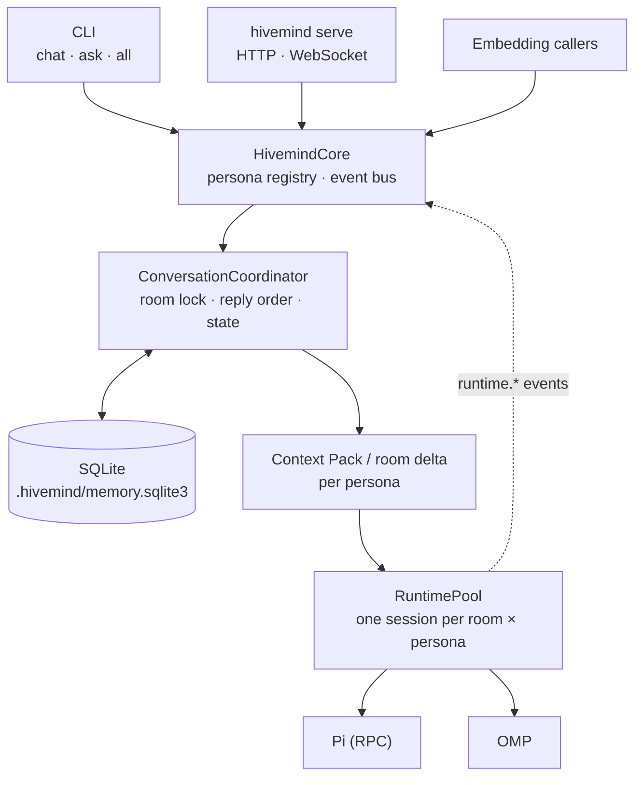

<div align="center">

# 🐝 Hivemind

**A runtime-agnostic meta-harness for persistent AI agents.**

Hivemind owns the conversation, the memory, and the CLI.<br>
[Pi](https://github.com/badlogic/pi-mono) and [oh-my-pi (OMP)](https://github.com/can1357/oh-my-pi) just do the thinking.

[](https://github.com/Anxiety471/Hivemind/actions/workflows/ci.yml)


[Quick start](#-quick-start) •
[CLI](#-cli) •
[Configuration](#%EF%B8%8F-configuration) •
[Memory](#-deterministic-memory) •
[API](#-http--websocket-api) •
[Web UI](#%EF%B8%8F-web-ui) •
[Architecture](#%EF%B8%8F-architecture)

</div>

---

## ✨ Highlights

- 🧠 **Agents belong to Hivemind, not to a runtime.** Pi, OMP, and OpenCode are interchangeable adapters behind one `HarnessSession` boundary, selected per agent.
- 💾 **Canonical SQLite history.** Rooms, turns, summaries, state, and memory live in `.hivemind/memory.sqlite3`. Any runtime session can be rebuilt from it.
- ♻️ **Persistent, disposable sessions.** A session lives across turns for one room + persona. It rotates when its context budget fills and is discarded on failure. Nothing gets lost when it goes away.
- 👥 **Rooms and groups.** You can talk to one persona (solo), all of them (main), or a persisted group in `broadcast` or `discussion` mode.
- 🔢 **Deterministic reply order**, set globally or per group.
- 🗂️ **Seven-layer memory with no LLM needed.** It uses FTS5 search, scope binding, provenance, and supersession.
- 🔌 **Embeddable core** with a typed event bus, plus a loopback HTTP/WebSocket API.
- 🖥️ **Web UI** for rooms, threads, tasks, groups, workspaces, and runtime sessions.

---

## 🚀 Quick start

**Prerequisites**

- Linux x86_64 for the current prebuilt release.
- At least one supported runtime (**Pi** or **OMP**), installed and signed in to a provider through that runtime's own setup. Hivemind itself never calls a provider during setup.

Install the latest GitHub release:

```bash
curl -fsSL https://raw.githubusercontent.com/Anxiety471/Hivemind/main/scripts/install.sh | sh
```

Then initialize and verify the local setup:

```bash
hivemind --version
hivemind init            # writes hivemind.toml (never overwrites without --force)
pi --version             # or: omp --version
hivemind doctor
hivemind                 # starts interactive chat
```

The installer downloads the prebuilt binary from the latest GitHub Release, verifies its SHA-256 checksum, and installs it to `~/.local/bin/hivemind` by default. Override that location with `HIVEMIND_INSTALL_DIR`.

Update an installed binary with:

```bash
hivemind update
```

Use `hivemind update --check` to check without installing. Interactive chat and `serve` also perform a best-effort background release check and print a notice when a newer version exists. Set `HIVEMIND_NO_UPDATE_CHECK=1` to disable that notice. Updates are never installed automatically.

Take a look at `hivemind.toml`. The starter config uses **Pi for both example agents**, so you only need Pi unless you change an agent's `runtime`. Set up a provider/model inside the runtime before starting chat.

### Build from source

For development, install Rust stable with Cargo and build directly from the repository:

```bash
git clone https://github.com/Anxiety471/Hivemind.git
cd Hivemind

rustc --version && cargo --version
cargo build
cargo run -- init
cargo run -- doctor
cargo run
```

> [!NOTE]
> `doctor` only checks runtimes that your configured agents use. It finds binaries on `PATH` (or at an explicit executable path) and also checks workspaces and reply order. `hivemind.toml` is local-only and ignored by Git.

For browser-first setup, you can skip `hivemind init` and start `hivemind serve`. With no config file, the server opens in setup mode; the Web UI saves the initial personas directly to `hivemind.toml` and activates them without a restart.

<details>
<summary><b>🩺 Setup troubleshooting</b></summary>

- **Missing runtime:** install or configure it, or set the matching `[runtime]` binary to its executable path. Only runtimes that agents use are checked.
- **Workspace errors:** each workspace must be an existing directory. Update `workspace` or create the directory before you start chat.
- **Provider credentials** belong to Pi, OMP, or OpenCode. Check authentication with that runtime's own setup. `doctor` only checks that the executable exists and never contacts a provider.
- **Reply order:** entries must be unique names of configured agents. Any agents you leave out are added in declaration order.

</details>

---

## 💻 CLI

The shell CLI is the main way to inspect Hivemind, run one-shot prompts, and manage persisted groups. `--config` also works before nested commands, e.g. `hivemind --config ./my-hive.toml group list`. With Cargo, put `cargo run --` in front of any command.

| Command | Description |
| --- | --- |
| `hivemind init [--force]` | Create a starter configuration |
| `hivemind doctor` | Check local configuration and runtime executables |
| `hivemind update [--check]` | Check for or install the latest GitHub release |
| `hivemind chat` | Start interactive chat in the `main` room |
| `hivemind chat --solo <persona>` | Chat with one persona |
| `hivemind chat --group <name>` | Chat in a persisted group |
| `hivemind agents` | List configured agents |
| `hivemind status` | Show configuration and runtime readiness |
| `hivemind order` | Print the effective reply order |
| `hivemind ask <persona> "<msg>"` | Prompt one persona once (recorded in its solo room) |
| `hivemind all "<msg>"` | Prompt every persona once (recorded in `main`) |
| `hivemind group create <name> <members…>` | Create a group |
| `hivemind group list` / `show <name>` | Inspect groups |
| `hivemind group add` / `remove <name> <persona>` | Change membership |
| `hivemind group delete <name>` | Delete a group |
| `hivemind task submit "<objective>"` | Store an autonomous task (see [docs/coordination.md](docs/coordination.md)); `serve` or `task run` processes it |
| `hivemind task list` / `show` / `cancel` / `pause` / `resume <id>` | Inspect and control tasks |
| `hivemind task watch <id>` | Follow a task's durable events; Ctrl-C stops watching, never the task |
| `hivemind task run [--until-idle]` | Process stored tasks in the foreground |

`ask` and `all` go through the same turn coordinator and durable turn store as interactive chat. `all` always writes to the `main` room, whatever the active interactive route is.

### 💬 Interactive slash commands

Inside `hivemind chat`, you can check status, switch routes, manage groups, or send a one-off turn without leaving the active conversation:

| Command | Description |
| --- | --- |
| `/help` | Show available commands |
| `/agents` · `/status` · `/order` · `/where` | Inspect agents, readiness, order, and the active route |
| `/ask <persona> <msg>` | One-off turn in that persona's solo room |
| `/all <msg>` | One-off turn in the `main` room |
| `/solo <persona>` · `/main` | Switch the active route |
| `/group create\|list\|show\|use\|add\|remove\|delete …` | Manage groups; `use` switches to a group |
| `/quit` · `/exit` | Leave chat |

> [!TIP]
> `/ask` and `/all` **don't change the active route**, so they never quietly add to the active group's history.

Group behavior:

- Deleting the active group sends you back to `main`.
- Empty groups can't be used for chat. Bare turns in a group that has become empty are rejected. `list` and `show` still display empty groups.
- Removing a member also clears that member's role and any explicit room-order entries for it.

On `SIGINT`, chat cancels the active turn through core shutdown, reports the failed turn, and stops taking input.

---

## ⚙️ Configuration

### Personas and runtimes

Each persona picks its own runtime, so OMP, Pi, and OpenCode can run side by side in one process:

```toml
[runtime]
omp_binary = "omp"
pi_binary = "pi"
opencode_binary = "opencode"
prompt_timeout_secs = 300   # max seconds of runtime inactivity (no text, tool, or status event) before a prompt times out; 0 disables
idle_timeout_secs = 120     # how long an unused session stays alive; 0 = never idle out
prompt_retries = 1           # extra attempts on the same model after a failed prompt (not after a timeout)

[[personas]]
id = "Engineer"
role = "Backend Engineer"
runtime = "pi"
workspace = "."
system_prompt = "You are the Engineer."
model = "provider/model-id"
fallback_models = ["provider/other-model-id"]   # tried in order if model fails
reasoning = "high"

[[personas]]
id = "Reviewer"
role = "Reviewer"
runtime = "omp"
workspace = "."
system_prompt = "You are the Reviewer."
fast = true
```

OpenCode persona (model is `provider/model-id`; the free `opencode/*-free` models need no API key):

```toml
[[personas]]
id = "Scout"
runtime = "opencode"
workspace = "."
system_prompt = "You are the Scout."
model = "opencode/big-pickle"
```

| Key | Notes |
| --- | --- |
| `runtime` | `"pi"`, `"omp"`, or `"opencode"`. Defaults to `"omp"` for older configs. Legacy `[[agents]]` entries are read as personas. |
| `workspace` | Working directory for the child process |
| `model` | OMP/Pi: maps to `--model`. OpenCode: `provider/model-id`, selected per session over ACP. |
| `reasoning` | OMP: maps to `--thinking`. The legacy key `thinking` is still accepted. Rejected for OpenCode. |
| `fast` | OMP only. Tri-state: leave it out to keep the default, or set `true`/`false` to apply once at session start. Rejected for Pi and OpenCode. |
| `role` | Default persona role. Group `member_roles` override it. |

**Web agent editor.** The UI offers the models and reasoning levels each runtime really lists (`GET /api/v1/runtimes/{runtime}/models`, cached for five minutes; `?refresh=true` re-reads it) instead of free text; any model id can still be typed. Fast mode appears only for OMP and reasoning only for OMP and Pi. Workspaces can be typed or picked with a folder browser (`GET /api/v1/fs/dirs`, confined to `[workspaces] roots` when set). Roles and permissions are check lists fed by `GET /api/v1/access/roles`.

**OpenCode runtime notes.** Hivemind runs `opencode acp` (Agent Client Protocol over stdio, no port) as one child per room + persona and deletes the OpenCode session on shutdown. The persona's `system_prompt` replaces OpenCode's `build` agent prompt for that child. Hivemind sets `"permission": "allow"` in the child's config, so OpenCode never waits for approval, including for files outside the workspace, exactly like Pi and OMP, which run tools unprompted. Treat the workspace as untrusted-model territory: an OpenCode agent can read and write anything your user can. Reported context size is OpenCode's own `usage_update`, which already includes OpenCode's built-in prompt (several thousand tokens), so set `runtime_rotate_tokens` accordingly.

**Harness isolation.** Your own Pi, OMP, and OpenCode setups stay untouched, but none of them reaches a Hivemind agent: no extensions or plugins, skills, MCP servers, context files (`AGENTS.md`, `CLAUDE.md`, …), rules, commands, or harness memory. That includes project-level files in or above the workspace. Persona settings plus the instructions and tools Hivemind injects are the agent's only setup. Logins and credentials stay shared, so authenticated providers keep working. Hivemind writes its harness files under `.hivemind/harness/`.

| Runtime | How |
| --- | --- |
| Pi | `--no-extensions --no-skills --no-prompt-templates --no-themes --no-context-files --no-approve`. `~/.pi/agent` settings and `auth.json` still apply. |
| OMP | `--no-extensions --no-skills --no-rules` plus `--config .hivemind/harness/omp.yml`, an overlay that disables every discovery source (`disabledProviders`) and turns off OMP memory, auto-learn, and the advisor. Global `~/.omp/agent/config.yml` (model roles, providers) and `agent.db` credentials still apply. Because the overlay's `disabledProviders` replaces yours, model providers you disabled globally are enabled again for Hivemind agents. |
| OpenCode | `OPENCODE_CONFIG_DIR=.hivemind/harness/opencode` replaces `~/.config/opencode`, and `OPENCODE_DISABLE_PROJECT_CONFIG=1` stops discovery from the workspace upward. The only config is what Hivemind passes in `OPENCODE_CONFIG_CONTENT`. Providers or models defined only in your global OpenCode config are unavailable. `plugins/hivemind.js` is a no-op Hivemind writes because OpenCode 2.0.18 hides its built-in `opencode` provider (the free models) when no plugin loads. Skills under `~/.claude/skills` and `~/.agents/skills` still load: OpenCode has no switch for them. |

**Opt-in OpenCode E2E.** `HIVEMIND_E2E_OPENCODE=1 python3 scripts/e2e-opencode.py` drives a real `hivemind serve` against `opencode/*-free` models (probed at run time; endpoints come and go). Each scenario uses its own scratch directory and XDG data/config dirs, and an empty workspace. Free tiers can forward prompts to third-party providers: never point it at a workspace with secrets. It covers context retention, two-agent reply order, a memory-tool round trip checked in SQLite, rotation, prompt timeout, a mixed pi/omp/opencode room (skipped without `pi`/`omp`), and shutdown leaving no children. Two longer scenarios go beyond basic chat: a conversation tree (two solo rooms, a broadcast group, a three-member discussion chain with a `Goal:` directive and a follow-up turn, a return to a solo room, and the main room, checking that rooms do not leak history into each other and that each room+persona gets its own runtime instance) and a six-turn conversation that must still recall its first-turn codeword after repeated rotations. `HIVEMIND_E2E_ONLY=s8,s9` runs selected scenarios. It is never part of `cargo test`, and rate limits or flaky models fail a scenario rather than being retried.

### Reply order and groups

```toml
[conversation]
reply_order = ["Reviewer", "Engineer"]
```

- Personas you leave out follow declaration order.
- **Main/all** turns use broadcast mode. **Solo** turns use the same room/history/context setup with one participant.
- Each group sets `mode = "discussion"` (default) or `mode = "broadcast"`. It can override roles in `[groups.member_roles]` and set its own `reply_order` with members only. A partial order puts the remaining members after it, in global order.
- **Who replies to whom.** Every persona in a room replies to every message you send, in plain text, in reply order (main, solo and groups; both modes). `@Name` is optional: put it in a persona's reply and that member (persona id, case-insensitive) gets a follow-up reply with the mention in view, unless a reply from them is already pending. In `discussion` mode members also see the earlier replies of the turn; in `broadcast` mode they answer independently and in parallel. Once every pending `discussion` reply is in, the floor opens: the other members, in order after the last speaker, may follow up unprompted or answer exactly `PASS` (not recorded), until all of them pass in a row, so a debate continues without anyone having to `@` the other side. `conversation.mention_limit` caps mention and floor follow-ups together per turn (default 4, max 16, `0` turns follow-ups off), so a lively exchange always ends. When 2 or fewer follow-up replies remain in the budget, agents are reminded in their prompt to finish what they are doing and conclude the exchange. Each group chat can override the budget in its settings (`follow_up_limit`: a number 0-64, `"unlimited"`, or `null` for the default); unlimited keeps going until everyone passes, with a safety ceiling of 200 follow-ups per turn. Agents never start turns on their own.
- **Shared workspace.** A group works in one directory only when it has one: set `workspace = "/abs/path"` on the `[[groups]]` entry, or tell the group in chat where it is and an agent records it with `workspace.set`. Group rooms get `workspace.get`, `workspace.set`, `workspace.clear` (removes it, so members return to their own workspaces) and `workspace.list`. Every member runs there from the next message; live sessions started elsewhere are restarted. Without one, members keep their own persona workspaces and are told not to assume a shared directory.
- **Solo workspace.** A solo room offers `workspace.get`, `workspace.set` and `workspace.list`. `workspace.set` changes that persona's own `workspace` in the config file, so it applies to the persona everywhere it runs (solo, main, and groups without a shared workspace). A shared group workspace still wins inside that group. There is no clear for solo: a persona always has a workspace.
- **Limiting agents.** Tools accept only absolute, existing directories. Add `[workspaces]` `roots = ["/abs/dir", ...]` to restrict agent choices to those directories and their subdirectories (symlinks are resolved, so they can't escape); `workspace.list` shows each root and its visible subdirectories. With no roots, any existing directory is accepted and `workspace.list` says there is nothing to list. Paths you write in the config are never checked. Personas with roles need `group.manage` (group) or `workspace.write` (solo) to change a workspace. Full rules: [docs/workspaces.md](docs/workspaces.md).

| Mode | Behavior |
| --- | --- |
| `broadcast` | All participants run concurrently with the same turn context |
| `discussion` | Participants run in effective order; each one sees the earlier replies from the same turn |

### Context

`[context]` sets the recent raw-turn window, summary size and refresh cadence, and an approximate context budget. `runtime_rotate_tokens` (default 150000) is the live context size that triggers a session rotation before that agent instance's next turn; it must exceed `context_target_tokens`, which caps each full context pack (default 12000).

### Room state directives

Room state only changes from explicit line-based directives in **user** input. Agent prose is never treated as a state update.

```text
Goal: ship the parser safely
Decision: use typed updates
Assign: Engineer = implement parser
Question: should malformed lines be rejected?
Completed: define the update syntax
Global: Hivemind architecture: runtimes are disposable
```

- `Goal` replaces the current goal.
- Repeated `Decision`, `Question`, and `Completed` values are stored only once.
- `Assign` takes the form `persona = task` and replaces that persona's assignment.
- Every later context pack includes the structured state.

> [!IMPORTANT]
> `Global:` lets through **exactly one** global memory write for that turn. An agent's `memory.global.propose` is accepted only if its content exactly matches the trimmed text after `Global:`. Anything else is rejected deterministically. Hivemind ties the authorization to the directive's turn and message, never to arguments supplied by a model or tool.

---

## 🧠 Deterministic memory

Hivemind has a seven-layer memory system that **works without any LLM**. The default is `[memory] mode = "deterministic"`: storage, retrieval, and policy are plain code, so memory keeps working when no model, provider, or quota is available.

| Layer | Owner | Behavior |
| --- | --- | --- |
| Harness working context | Pi/OMP/OpenCode session | Disposable; rebuilt from the layers below if the runtime restarts |
| Recent conversation | room | Raw window capped by `[context] recent_turns`; older turns stay in the archive |
| Group shared memory | group | Visible only to that group's members |
| Private memory | agent instance | Visible only to that room/persona identity; the same persona in different rooms gets separate memories |
| Persona memory | persona | Shared by every instance of the same persona |
| Hivemind global | system-wide | Durable project-wide facts, under the strictest policy |
| Canonical archive | Hivemind | Durable source of truth for rooms, turns, messages, and memory records |

- 🔍 **Storage.** A local SQLite archive with FTS5 full-text indexes over memories and archived messages. Search is deterministic and needs no embedding service.
- 🔒 **Scope binding.** Hivemind attaches the caller's own context to every memory request and works out the group, instance, and persona from it. Requests never name an owner. An agent can't read another group's memory or another instance's private notes, and it can't pose as a different persona.
- ✍️ **Writes.** Private and group writes are accepted directly within the caller's own scope. Persona and global writes are proposals that Hivemind's policy checks before committing. An agent's bare opinion never becomes global truth.
- 🧾 **Provenance and supersession.** Every record keeps its origin (room, turn, message, actor). Corrections create revisions. An old record is kept as `superseded` instead of being deleted, so history stays searchable.
- 🌉 **One tool bridge.** Pi, OMP, and OpenCode reach memory through a single tool bridge owned by Hivemind. Runtime adapters only carry the transport. Hivemind also injects guidance that tells each agent which capabilities it has, which scopes it may touch, and that it should search memory rather than pretend to remember.

---

## 🔌 HTTP & WebSocket API

```bash
cargo run -- serve     # binds to http://127.0.0.1:7474
```

> [!CAUTION]
> Loopback is the default. Remote binding requires an operator token; use HTTPS/WSS and an explicit origin allowlist. See [execution and remote access](docs/execution.md).

Building the server and serving health/info/agent listings never starts Pi, OMP, or OpenCode. All endpoints use the `/api/v1` prefix.

| Method | Endpoint | Description |
| --- | --- | --- |
| `GET` | `/api/v1/health` | Liveness check; never contacts a provider |
| `GET` | `/api/v1/info` | Service metadata and protocol endpoints |
| `GET` | `/api/v1/agents` | Safe agent metadata (name and runtime only; no credentials) |
| `GET` / `POST` | `/api/v1/setup` | Check setup state and save the first persona configuration; POST is one-shot |
| `POST` | `/api/v1/turns`, `/api/v1/rooms/{id}/steer` | Submit a conversation turn (`/turns`), or steer text into active replies mid-flight (`/rooms/{id}/steer`) |
| `POST` / `GET` | `/api/v1/tasks`, `/api/v1/tasks/{id}` | Submit (202) and inspect autonomous tasks; see [docs/coordination.md](docs/coordination.md) |
| `GET` / `POST` | `/api/v1/tasks/{id}/attempts`, `/cancel`, `/pause`, `/resume`, `/input`, `/steer`, `/context-metrics` | Attempts, controls (`/input` also answers a running `tasks.ask`; `/steer` messages a running attempt), and bounded context diagnostics |
| `GET` | `/api/v1/agents/{id}`, `/api/v1/agent-instances` | Capabilities and derived activity (never starts a runtime) |
| `GET` / `POST` | `/api/v1/messages`, `/api/v1/groups`, `/api/v1/groups/{id}` | Agent/operator messages and dynamic task groups |
| `GET` | `/api/v1/events?after=N` | Durable, restart-safe event replay with a high-water mark |
| `GET` | `/api/v1/ws` | WebSocket live event stream |

<details>
<summary><b>Example responses</b></summary>

```bash
curl http://127.0.0.1:7474/api/v1/health
```
```json
{ "status": "ok", "service": "hivemind" }
```

```bash
curl http://127.0.0.1:7474/api/v1/info
```
```json
{ "name": "hivemind", "version": "0.1.0", "api_version": "v1", "websocket": "/api/v1/ws" }
```

```bash
curl http://127.0.0.1:7474/api/v1/agents
```
```json
{ "agents": [ { "name": "Reviewer", "runtime": "omp" }, { "name": "Engineer", "runtime": "pi" } ] }
```

</details>

See [durable async jobs, measured usage budgets, host verification, and recovery](docs/execution.md) for the execution endpoints and configuration.

### Submitting turns

```json
{"target":{"type":"group","id":"development"},"message":"Review the runtime lifecycle."}
```

The response includes `turn_id`, `room_id`, and an ordered list of `replies`, each with `persona_id`, `ok`, and `content`. Use `turn_id` and `room_id` to link the response to the matching WebSocket events. Responses never include provider diagnostics or prompts.

| Status | Meaning |
| --- | --- |
| `400` | Malformed or empty request |
| `404` | Target not found |
| `503` | Shutting down |

When the server shuts down, core shutdown starts first and WebSocket clients are notified before Axum finishes in-flight HTTP requests. Interrupted HTTP turns still get the API's sanitized failed-reply response.

### WebSocket protocol

Frames are JSON envelopes with a `type`, an optional correlation `id`, and a `payload`.

```bash
websocat ws://127.0.0.1:7474/api/v1/ws        # or: bunx wscat -c ws://127.0.0.1:7474/api/v1/ws · or: npx wscat -c ws://127.0.0.1:7474/api/v1/ws
```

```jsonc
// ← on connect
{"type":"system.ready","payload":{"service":"hivemind","protocol_version":1}}
// → ping
{"type":"system.ping","id":"req-1","payload":{}}
// ← pong, same id
{"type":"system.pong","id":"req-1","payload":{}}
```

Unsupported or malformed messages get a `system.error` frame, and the connection stays open when possible.

**Streamed events**

| Group | Events |
| --- | --- |
| Conversation | `conversation.turn.started`, `conversation.turn.completed` |
| Replies | `agent.reply.started`, `agent.reply.completed`, `agent.reply.failed` |
| Runtime | `runtime.started`, `runtime.stopped`, `runtime.rotated`, `runtime.failed` |
| System | `system.events_lagged` with `missed_count` and `refresh_required: true` |

> [!NOTE]
> Events are short-lived **notifications**, not canonical records. Durable history and memory stay in SQLite. A subscriber that falls behind the bounded buffer gets `system.events_lagged` in place of the dropped events.

---

## 🖥️ Web UI

`frontend/` is a browser UI built on the public API: first-run persona setup, rooms with live replies and threads, autonomous tasks with attempts and controls, agents, chat groups, workspaces, runtime sessions, and a live event feed. The web UI runs on Bun (preferred) or Node.js/npm.

```bash
hivemind serve                               # API on http://127.0.0.1:7474
cd frontend && bun install && bun run dev    # UI on http://127.0.0.1:5173
# or: cd frontend && npm install && npm run dev
```

Or run both with one command: `scripts/dev.sh` (extra arguments go to `hivemind serve`; set `HIVEMIND_BIN` to use a prebuilt binary instead of `cargo run`). Ctrl-C stops both.

On a fresh install, start the server without running `hivemind init`; the Web UI handles the initial persona setup and saves it directly on the server.

No model handy? `frontend/dev/demo.sh` runs `serve` with a scripted stand-in runtime, and `bun frontend/dev/seed.mjs  (or: node frontend/dev/seed.mjs)` fills it with sample data. See [frontend/README.md](frontend/README.md) and the [Web UI](https://github.com/Anxiety471/Hivemind/wiki/Web-UI) wiki page.

---

## 🏗️ Architecture



**Where things run**

- `serve`, `ask`, `all`, and `chat` all build a library `HivemindCore`. It holds the ordered persona registry, one SQLite-backed memory service, one durable conversation coordinator, a per-instance runtime pool, and a bounded process-local event bus.
- `chat` uses one core for the whole session. `ask`/`all` build a new core for each command.
- The core resolves targets (main, solo, group) into room identity, mode, participants, roles, and reply order. Participants are checked before any runtime starts.
- Room turns are serialized by a room lock. Broadcast runs concurrently. Discussion runs in order and includes the earlier replies from the same turn.

**Session lifecycle**

- Each agent instance is identified by its structured **(room, persona)** IDs. A session can last across turns for that instance but is never shared between rooms or personas.
- The first prompt of a session carries the full **Context Pack**. Later turns send only a **room delta**, and memory-tool follow-ups send only the tool result.
- At a turn boundary, a session rotates (`runtime.rotated`) if its context has reached `context.runtime_rotate_tokens` or its next delta can't be built.
- If a prompt fails, Hivemind drops the session, closes its runtime epoch, and retries the turn on a fresh session rebuilt from room history: `runtime.prompt_retries` extra attempts (default 1) on the persona's `model`, then one attempt on each entry of its `fallback_models` in order. A prompt timeout (`runtime.prompt_timeout_secs`) skips the same-model retry and goes straight to the fallbacks. If every attempt fails, the last error is reported as an error attributed to that agent. A fallback model that answers stays the live session's model until the session rotates or idles out.
- A session closes after `runtime.idle_timeout_secs` without use and stops on core shutdown. No session is left running after exit.
- **Pi** runs in RPC mode with `--no-session` and keeps its in-process context between prompts. Hivemind waits for `agent_settled` and returns the text blocks from the latest assistant `message_end`.

**Storage.** `.hivemind/memory.sqlite3` sits next to the config file and holds rooms, turns, messages, scoped memory with FTS5, runtime epochs (with the reason each session ended), and group state. It runs in WAL mode with `synchronous=NORMAL`: an application crash loses nothing, but power loss or an OS crash can drop the last few committed turns (the database is never corrupted). A turn writes only its own new messages, and searches are scoped to a room or memory scope inside FTS5. `.hivemind/context/` holds only room turn-lock files and any legacy JSON history that hasn't been migrated yet.

<details>
<summary><b>🧬 Identity encoding & legacy migration</b></summary>

- At storage and public-protocol boundaries, the (room, persona) identity is written as `agent_instance_id` in the stable, versioned **`ai1` length-prefixed** encoding. It round-trips without guessing where one ID ends and the next begins. It is a serialization of the structured IDs, not the identity itself.
- **Legacy JSON room history** is imported exactly once: every turn and the room snapshot are written to SQLite, and the JSON file is removed only after that succeeds.
- **Legacy private-memory rows** keep `scope_type = 'agent_instance'` and stay opaque to typed callers. New rows use `agent_instance_v1` with `ai1`.
- **Legacy runtime epochs** keep identity version `0` and are never returned or closed through typed lookup. New epochs use version `1`.
- **Legacy JSON history identities** have no version marker. On import, the typed identity is rebuilt only from the authoritative room and speaker fields. New entries carry `agent_instance_identity_version = 1`.
- Hivemind **never splits** an old `room/persona` string on the delimiter, since IDs may themselves contain `/`.

</details>

### Embedding

The library's `core`, `events`, `conversation`, `config`, `runtime`, and `memory` modules expose the kernel for embedding. `HivemindCore::events().subscribe()` returns an independent, bounded Tokio broadcast receiver of typed `DomainEvent`s, with process-local sequence, ID, and timestamp metadata. Slow consumers must handle `RecvError::Lagged`, for example by refreshing from authoritative state.

---

## 🚧 Current limitations

- Memory search is SQLite FTS5 full-text matching, not semantic/embedding search. There is no vector database.
- Final responses are collected at the end of each turn. WebSocket `agent.progress` delivers assistant text and sanitized tool activity as supported by each runtime.
- Autonomous coordination (`[coordination] enabled = true`) is off by default, runs only while `serve` or `task run` is running, and has documented limits: see [docs/coordination.md](docs/coordination.md).
- Remote access uses opt-in single-operator bearer authentication; multi-user tenancy is not implemented.
- A runtime failure mid-turn is reported as an agent-attributed error and never retried.

## 📄 License

No license has been chosen yet.

### Artifact Library

Hivemind stores chat attachments and generated deliverables in its own searchable Library. Agents can reference saved IDs and publish revocable URLs that users open directly. See [Artifact Library](docs/artifact-library.md) for automatic collection, agent tools, permissions and deployment configuration.

### Automated task issues

The web **Tasks** page supports numbered issues, descriptions, labels, priorities, discussion, and a Linear-inspired grouped ticket list. Filter Active, Backlog, All, or Closed issues and open a ticket for its discussion and automation details. Save an issue to the backlog or start automatic planning, capability-based assignment, execution, and review. See [task issue workflow and API](docs/task-issues.md).
