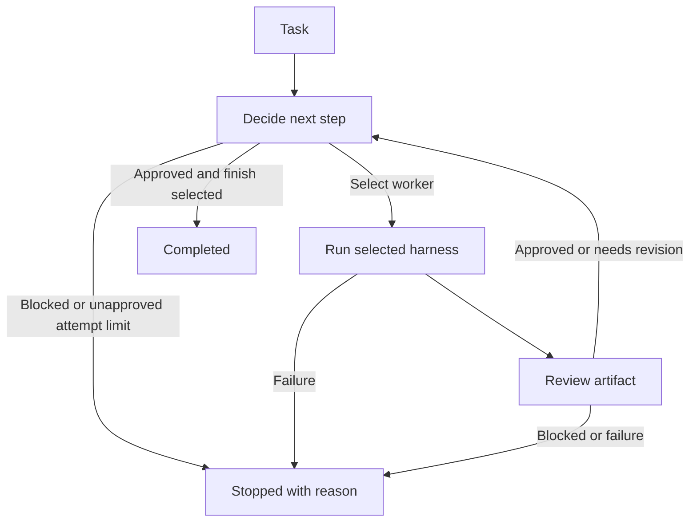

# Hivemind

A fresh **TypeScript terminal app** built on LangGraph, with a basic interactive TUI and scriptable CLI. A router chooses a worker, the worker runs through its configured harness, and a reviewer checks the resulting artifact. Review feedback can send the task through another iteration.

This is the new workflow foundation. It does not restore the previous Hivemind application.

## Run it

Requires Node.js 22 or newer and npm.

```sh
npm ci
npm run demo
npm run dev -- --task "Write a project introduction"
npm run dev -- --config examples/demo.json --graph
npm run dev -- --config examples/demo.json --task "Write a project introduction" --json
npm run dev -- --config examples/demo.toml --task "Write a project introduction"
```

`--config` accepts both `.json` and `.toml`; the extension selects the parser and the format that setters write back. The shipped `examples/demo.toml` and `examples/multi-harness.toml` mirror their `.json` counterparts.

The demo runs offline without API keys. It deliberately rejects the first draft, revises it, approves the second draft, and finishes. Demo responses are deterministic examples, not live AI results.



Use `--graph` to print Mermaid generated from the actual LangGraph workflow.

## Configuration files

A config file names the harness registrations, the agents (one reviewer, one or more workers, optional router agent), the router, and the loop limits. JSON uses the camelCase field names shown elsewhere in this README. TOML uses the same structure with `snake_case` keys — the mapping is mechanical and uniform in both directions (`maxAttempts` ↔ `max_attempts`, `timeoutMs` ↔ `timeout_ms`, `baseUrl` ↔ `base_url`, `apiKeyEnv` ↔ `api_key_env`, `maxTokens` ↔ `max_tokens`, `executableArgs` ↔ `executable_args`, `maxOutputBytes` ↔ `max_output_bytes`), with no per-field exceptions. Harnesses are `[harnesses.<id>]` tables and agents are an `[[agents]]` array of tables.

```toml
max_attempts = 3

[router]
type = "rule"

[harnesses.demo]
type = "demo"

[[agents]]
id = "writer"
role = "worker"
harness = "demo"
description = "Writes and revises the artifact"

[[agents]]
id = "reviewer"
role = "reviewer"
harness = "demo"
description = "Checks the latest artifact"
```

On load, `personas` is accepted as an alias for the `agents` array (compatibility with the `hivemind.toml` shape), but agents are always serialized back as `agents`. Run the TOML example:

```sh
npm run dev -- --config examples/demo.toml --task "Write a project introduction"
```

The TOML is deliberately `hivemind.toml`-style (snake_case, `[[agents]]`), but it is **not** field-for-field compatible with the Rust backend's config on `main`. This restart uses a different runtime model — harness registrations plus agents — rather than that backend's personas and runtimes, so a Rust config is not a drop-in replacement and `--migrate-config` only converts between this project's own JSON and TOML formats.

### Editing configuration from the CLI

The setters rewrite the file you pass to `--config` in place, preserving its format; they validate before writing, so an invalid edit fails without touching the file. Copy a shipped example to a scratch file before editing it — the repository examples are not writable working copies:

```sh
cp examples/demo.toml hivemind.toml
npm run dev -- --config hivemind.toml --show-config
npm run dev -- --config hivemind.toml --add-agent "editor:worker:demo" --set-max-attempts 5
npm run dev -- --config hivemind.toml --dry-run --remove-agent editor
```

| Flag | Effect |
| --- | --- |
| `--show-config` | Print the effective configuration in the target file's format and exit without running the workflow |
| `--dry-run` | Apply the setters and print the resulting config text instead of writing the file |
| `--set-router <rule\|model:AGENT>` | Set the router: the built-in rule router, or the model router backed by the named router agent |
| `--set-max-attempts <n>` | Set `max_attempts` / `maxAttempts` (1–100) |
| `--set-timeout-ms <ms>` | Set `timeout_ms` / `timeoutMs` (positive) |
| `--set-agent-harness <agentId>=<harnessId>` | Point an agent at an existing harness registration |
| `--set-harness-model <harnessId>=<model>` | Set a harness's `model` |
| `--set-harness-cwd <harnessId>=<path>` | Set a harness's `cwd` working directory |
| `--add-agent <id>:<role>:<harnessId>` | Add an agent with the given role and harness |
| `--remove-agent <id>` | Remove an agent, unless it would leave the config without a worker |
| `--remove-harness <id>` | Remove an unused harness registration |
| `--migrate-config [outPath]` | Read `--config` and write the same configuration as TOML; defaults to the input path with its extension swapped to `.toml` |

The format is always chosen by the `--config` file's extension, never by a flag. Setters apply in the order they are listed above, then the result is checked for runnability and saved (unless `--dry-run`).

Invalid edits — duplicate agent IDs, a removed harness still referenced by an agent, a missing worker, or unknown IDs — stop with an error before anything is written. Before any save, the CLI and TUI check the config is runnable: exactly one reviewer, at least one worker, every agent's harness registered, and in-range limits.

## Interactive TUI

```sh
npm run tui
# Native OpenCode worker + Pi reviewer, after authenticating both CLIs:
npm run tui -- --config examples/opencode-pi.json
# Prefill a task without automatically starting it:
npm run tui -- --task "Review the project"
# Let the agents work in another directory instead of the terminal's:
npm run tui -- --project ~/code/site
```

Running `npm run dev` without a task in an interactive terminal also opens the TUI. Scriptable `--task`, `--json`, and `--graph` commands retain their existing behavior. Explicit `--tui` requires an interactive stdin/stdout and cannot be combined with `--json` or `--graph`.

### Layout

The TUI works like Claude Code: the conversation is a transcript that flows into your terminal's normal scrollback, with a prompt box and a status line at the bottom.

- **Transcript** — a welcome banner (working directory and config file), then each task you submit (`> task`), and for each run a one-line summary such as `● completed · 2 attempts · 1 revision` (yellow or red, with the reason, when a run is cancelled, blocked, exhausted, or fails) followed by the worker's artifact under `⎿`. Command output such as `/help` or `Working directory → ~/code/site` appears the same way. Finished entries are written once, so scroll back with your terminal as usual.
- **Live run** — while a run is active, the decide ──▶ work ──▶ review loop diagram (with the revise back-edge, attempt pips, and the three latest workflow events) and the current stage, e.g. `◉ Working · writer via demo`, appear above the prompt.
- **Prompt** — type a task and press Enter. The prompt stays editable during a run so you can draft the next task, but Enter only starts a new task once the current run ends. Typing `/` opens the command menu under the prompt.
- **Status line** — the project directory, the selected `worker → harness`, the reviewer, the router (`rule` or `model:<agent>`), a yellow `demo` tag when the worker or reviewer harness is simulated, and the config file name.

### Slash commands

All configuration lives behind `/` commands. While the input is a bare `/word`, the menu lists matching commands: `↑`/`↓` move the highlight, `Tab` completes it, `Enter` runs it (or the exact command you typed), and `Esc` closes the menu.

| Command | Action |
| --- | --- |
| `/help` | List commands and key bindings |
| `/settings` (alias `/config`) | Open the settings editor: router, limits, and each agent's harness, saved to the config file |
| `/cwd [path]` (alias `/dir`) | Change the project directory; without a path, open the directory picker |
| `/worker [id]` | Choose the worker for the next runs; without an id, pick from a list |
| `/harness [id]` | Choose the selected worker's harness for the next runs; without an id, pick from a list |
| `/clear` | Clear the screen and the transcript |
| `/exit` (alias `/quit`) | Interrupt any run and exit |

An unknown command prints `Unknown command /foo — /help lists commands`.

`/worker` and `/harness` apply to the following runs of this session only and are never written to the config file; choosing a worker also resets the harness to that worker's configured one. The reviewer and router stay as configured. Each submission starts a fresh graph run, and the transcript is not fed into later tasks.

### Settings editor

`/settings` (or `Ctrl+S` / `Ctrl+O` from the prompt) replaces the prompt with the settings editor, which edits the persistent configuration and saves it to the config file you passed, so changes survive the session. `↑`/`↓` or `Tab`/`Shift+Tab` change the field, `←`/`→` cycle the focused value, `Enter`, `s`, `Ctrl+W`, or `Ctrl+E` save, and `q`, `Esc`, `Ctrl+S`, or `Ctrl+O` close it, discarding unsaved edits. Saving is refused while a run is active, and every save is first checked for runnability. After a save, the next run uses the new setup, starting from the first worker.

Every Ctrl chord has a plain-key alternative because some terminals intercept them before the app sees them — Zed's built-in terminal, for example, does not deliver `Ctrl+S` ([zed#57216](https://github.com/zed-industries/zed/issues/57216)). Typing `/settings`, then `s` to save and `q` to close, needs only ordinary keys.

### Keys

| Key | Action |
| --- | --- |
| Enter | Run the task, or the highlighted `/` command |
| ↑ / ↓ · Tab | Move through the `/` menu · complete the highlighted command |
| ← / → · Home / End | Move the prompt cursor |
| Backspace / Delete | Edit the prompt |
| Ctrl+U | Clear the prompt |
| Esc | Close an open panel; otherwise interrupt the active run; otherwise clear the prompt. Esc never exits |
| Ctrl+S / Ctrl+O | Open settings |
| Ctrl+C | Interrupt the active run, or exit when idle |
| Ctrl+D | Exit from an empty prompt |

### Project directory

Agents work in the **project directory**, which defaults to the directory you launched Hivemind from — the same rule as Claude Code. `--project <dir>` starts in another directory (it also applies to `--task` runs), and `/cwd <path>` changes it during a session; relative paths resolve against the current project and `~` expands to your home directory. `/cwd` without a path opens a picker: `✓ Use <dir>` selects the directory being browsed, `..` and subdirectories descend (`←` also goes up), typing filters the subdirectories, a **Recent** section jumps to previously used projects, and `Esc` cancels.

For every run, filesystem harnesses (`opencode`, `pi`, and `command`) run in the project directory. A harness `cwd` in the config is resolved against the project, so `"cwd": "packages/web"` follows whichever project is active, while an absolute `cwd` is kept as is. `demo` and `openai-compatible` harnesses do not use a directory. The project is never stored in the config file.

Projects you start in or select are remembered, most recent first (up to 10), in `projects.json` under `$HIVEMIND_STATE_DIR`, or `$XDG_STATE_HOME/hivemind` (default `~/.local/state/hivemind`).

The TUI shows workflow progress and completed worker artifacts, rather than streaming model tokens. Cancellation propagates to API calls and native CLI processes; custom harnesses must honor their abort signal. Already-completed filesystem changes are not undone by cancellation. The layout adapts to the terminal width; below 40 columns it asks you to widen the window.

## Routing and stopping

The built-in rule router selects the first configured worker and finishes after review approval. A model router can select any configured worker based on its description and the current task, artifact, and feedback.

Model decisions are validated against these JSON shapes:

```json
{"action":"work","agent":"writer","instructions":"Revise using the review findings","reason":"The artifact needs changes"}
```

```json
{"action":"finish","reason":"The latest artifact passed review"}
```

```json
{"action":"block","reason":"The required source file is missing"}
```

The host rejects unknown workers and completion without approval of a nonempty artifact. Every new artifact clears prior approval and receives a fresh review. An attempt is one worker execution; router and reviewer calls have timeouts too. `maxAttempts` bounds the loop even when the router keeps requesting work. If the latest artifact is approved at the moment the limit is reached, the run finishes as `completed` rather than `exhausted`; only an unapproved artifact at the limit stops as `exhausted`.

Results contain the artifact, feedback, decision, status, attempt count, and execution events. Status is `completed`, `blocked`, or `exhausted`. A blocked run exits with its reason; it does not silently retry errors or claim success.

Review approval is a model judgment about the returned artifact. It is not proof that code was tested or that a task's external effects occurred. A future tool-backed validation step can enforce those requirements.

## Multiple harnesses

Each agent has a `harness` reference. Workers, reviewer, and router can use different registrations; several registrations can use the same adapter with different configuration.

| Adapter type | Behavior |
| --- | --- |
| `opencode` | Native `opencode run --format json`, with final assistant text extraction |
| `pi` | Native `pi --print --mode json --no-session`, with final assistant text extraction |
| `openai-compatible` | Calls a configured `/chat/completions` endpoint and model |
| `command` | Runs a local executable with a JSON request on stdin and artifact text on stdout |
| `demo` | Offline workflow demonstration |

Try the command adapter and a separate demo review adapter together:

```sh
npm run dev -- --config examples/multi-harness.json --task "Explain the workflow"
# Same configuration in TOML:
npm run dev -- --config examples/multi-harness.toml --task "Explain the workflow"
```

OpenCode and Pi have dedicated native adapters; no user-written wrapper is required. OMP, Claude Code, Codex, and other harnesses can use the generic command adapter until dedicated integrations are added. The command example is a runnable protocol demonstration, not a coding agent.

### Native OpenCode and Pi

Install the CLIs separately and authenticate/select a model in each CLI before running Hivemind. The adapters inherit their existing provider configuration and authentication; Hivemind does not copy credentials or pass API keys in command arguments.

```sh
# OpenCode npm distribution
npm install -g opencode-ai
# Current Pi npm distribution (the legacy @mariozechner package also provides pi)
npm install -g @earendil-works/pi-coding-agent

opencode auth login
pi
# In Pi: /login if needed, then /model. Exit when configured.

npm run dev -- --config examples/opencode-pi.json --task "Implement the requested change and report checks run"
# Reverse the harness roles:
npm run dev -- --config examples/pi-opencode.json --task "Implement the requested change and report checks run"
```

These examples use each CLI's configured default model. Set `model` explicitly when you need a particular model. OpenCode accepts `provider/model`; Pi accepts `provider` together with `model`, or a provider-qualified model ID.

| Setting | OpenCode | Pi |
| --- | --- | --- |
| `executable` | Default `opencode` | Default `pi` |
| `executableArgs` | Optional runtime prefix arguments | Optional runtime prefix arguments |
| `cwd` | Local project directory | Local project directory |
| `model` | Provider/model ID | Model ID or pattern |
| `agent` | OpenCode primary agent, such as `build` or `plan` | — |
| `variant` | Provider-specific reasoning variant | — |
| `provider` | — | Pi provider name |
| `thinking` | — | `off`, `minimal`, `low`, `medium`, `high`, `xhigh` |
| `tools` | Configured through OpenCode | Tool allowlist; `[]` disables tools |
| `maxOutputBytes` | Combined stdout/stderr cap; default 8 MiB | Combined stdout/stderr cap; default 8 MiB |

The prompt and previous artifact/feedback go through stdin, avoiding command-line prompt size limits and shell interpolation. The adapters consume native JSONL streams, exclude tool output and intermediate reasoning, and return final assistant text. Reviewer/router JSON stays intact for the graph's schema validation.

OpenCode gets a new session per call; Pi uses `--no-session`. Neither adapter resumes a global last session, so shared graph state supplies continuity. OpenCode may still save its fresh sessions through its own configuration. Nonzero exits, malformed/incomplete event streams, native session errors, and truncated/aborted final responses stop the run. No automatic fallback to raw protocol output is used.

The adapters preserve the harnesses' configured permissions and extensions; Hivemind does not add OpenCode's auto-approval flag. The Pi reviewer example selects read tools, but this is an allowlist configuration, not a filesystem sandbox. Configure each harness's permissions for your project.

On Windows, use a directly executable binary or `executable: "node"` with `executableArgs: ["path/to/the/CLI/entry.js"]` for npm JavaScript entry points. The adapters do not invoke `.cmd` launchers through a shell.

Protocols were checked against installed OpenCode 1.18.35, legacy Pi 0.73.1, current Pi 1.1.0, and the upstream CLI/event documentation. Tests use subprocess protocol fixtures, including a full OpenCode-worker/Pi-reviewer revision loop. Both installed Pi versions also completed native-adapter smoke runs with an offline test provider. Current Pi completion waits for `agent_settled`; legacy Pi uses `agent_end`. Paid/live model execution depends on your configured providers.

References: [OpenCode CLI](https://opencode.ai/docs/cli/), [OpenCode run implementation](https://github.com/anomalyco/opencode/blob/dev/packages/opencode/src/cli/cmd/run.ts), [Pi CLI](https://github.com/earendil-works/pi/blob/main/packages/coding-agent/README.md), [Pi JSON events](https://github.com/earendil-works/pi/blob/main/packages/coding-agent/docs/json.md).

### Command protocol

Configuration:

```json
{
  "type": "command",
  "command": "node",
  "args": ["--import", "tsx", "examples/command-worker.ts"],
  "maxOutputBytes": 1048576
}
```

A single JSON request is sent on stdin:

```json
{
  "agent": {"id":"developer","role":"worker","harness":"cli-worker","description":"Implements tasks"},
  "task":"The original request",
  "instructions":"The selected work instruction",
  "artifact":"The previous artifact, if any",
  "feedback":"The latest review feedback",
  "attempt":1
}
```

Workers return artifact text on stdout. Reviewers return `{"verdict":"approved|revise|blocked","feedback":"Specific findings"}` as JSON. Router wrappers return a decision matching the earlier shapes. Diagnostics belong on stderr. Processes must exit when the request is complete.

Commands execute without a shell. Nonzero exits, output overflow, and timeouts stop the run. Command configuration is trusted local configuration: executables inherit the host environment and permissions. Wrappers that spawn child processes must manage their own descendants when cancelled.

### Custom TypeScript harness

Implement `Harness.run(request, signal)` and register it:

```ts
import { HarnessRegistry, type Harness } from './src/index.js'

const harness: Harness = {
  async run(request, signal) {
    // Call your harness SDK here; honor cancellation and return artifact text.
    signal.throwIfAborted()
    return `Artifact for ${request.task}`
  },
}
const registry = new HarnessRegistry().register('my-harness', harness)
```

`createHivemind` accepts the registry, agent definitions, and a `Router`. Harnesses should honor the abort signal; the host ends timed-out calls even if a custom implementation ignores it, but cannot undo that implementation's external effects.

## Configure Jev later

`examples/model-router.json` demonstrates a model router, a model-backed worker, native OpenCode worker, and native Pi reviewer. The endpoint and model IDs are deliberate placeholders because Jev's provider details have not been configured.

1. Replace `decision-model.baseUrl` and `decision-model.model` with the real provider endpoint and Jev model ID.
2. Configure the model-backed worker endpoint/model and authenticate the native OpenCode/Pi CLIs.
3. Set `JEV_API_KEY` and `WORKER_API_KEY` in your environment.
4. Run:

```sh
npm run dev -- --config examples/model-router.json --task "Your task" --json
```

For an environment file, Node can load it explicitly:

```sh
node --env-file=.env --import tsx src/cli.ts --config examples/model-router.json --task "Your task"
```

The API adapter assumes OpenAI-compatible chat completions and text responses. If Jev uses a different protocol, supply a custom harness or command wrapper. No specific Jev compatibility or routing quality is claimed until tested with the real provider.

## Development

```sh
npm run check
npm test
npm run build
node dist/src/cli.js --config examples/demo.json --task "Write an introduction"
```

CLI exit codes: `0` completed/help/graph; `1` configuration or startup error; `2` blocked/exhausted run.

This first version executes one worker at a time, uses one reviewer, and keeps run state in memory for the current invocation. The configuration itself is persistent — `--config` reads a JSON or TOML file and the setters and TUI write it back — but restart recovery of an in-flight run, persistent sessions, parallel workers, tool policy, and a web interface are outside this foundation. A blocked run currently requires a new invocation with the missing information supplied.
