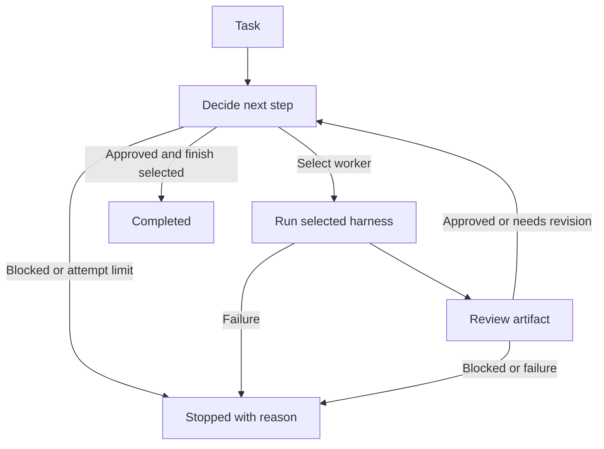

# Hivemind

A fresh **TypeScript CLI** built on LangGraph. A router chooses a worker, the worker runs through its configured harness, and a reviewer checks the resulting artifact. Review feedback can send the task through another iteration.

This is the new workflow foundation. It does not restore the previous Hivemind application.

## Run it

Requires Node.js 22 or newer and npm.

```sh
npm ci
npm run demo
npm run dev -- --task "Write a project introduction"
npm run dev -- --config examples/demo.json --graph
npm run dev -- --config examples/demo.json --task "Write a project introduction" --json
```

The demo runs offline without API keys. It deliberately rejects the first draft, revises it, approves the second draft, and finishes. Demo responses are deterministic examples, not live AI results.



Use `--graph` to print Mermaid generated from the actual LangGraph workflow.

## Routing and stopping

The built-in rule router selects the first configured worker and finishes after review approval. A model router can select any configured worker based on its description and the current task, artifact, and feedback.

Model decisions are validated against these JSON shapes:

```json
{"action":"work","agent":"writer","instructions":"Revise using the review findings","reason":"The artifact needs changes"}
```

```json
{"action":"finish","reason":"The latest artifact passed review"}
```

```json
{"action":"block","reason":"The required source file is missing"}
```

The host rejects unknown workers and completion without approval of a nonempty artifact. Every new artifact clears prior approval and receives a fresh review. An attempt is one worker execution; router and reviewer calls have timeouts too. `maxAttempts` bounds the loop even when the router keeps requesting work.

Results contain the artifact, feedback, decision, status, attempt count, and execution events. Status is `completed`, `blocked`, or `exhausted`. A blocked run exits with its reason; it does not silently retry errors or claim success.

Review approval is a model judgment about the returned artifact. It is not proof that code was tested or that a task's external effects occurred. A future tool-backed validation step can enforce those requirements.

## Multiple harnesses

Each agent has a `harness` reference. Workers, reviewer, and router can use different registrations; several registrations can use the same adapter with different configuration.

| Adapter type | Behavior |
| --- | --- |
| `opencode` | Native `opencode run --format json`, with final assistant text extraction |
| `pi` | Native `pi --print --mode json --no-session`, with final assistant text extraction |
| `openai-compatible` | Calls a configured `/chat/completions` endpoint and model |
| `command` | Runs a local executable with a JSON request on stdin and artifact text on stdout |
| `demo` | Offline workflow demonstration |

Try the command adapter and a separate demo review adapter together:

```sh
npm run dev -- --config examples/multi-harness.json --task "Explain the workflow"
```

OpenCode and Pi have dedicated native adapters; no user-written wrapper is required. OMP, Claude Code, Codex, and other harnesses can use the generic command adapter until dedicated integrations are added. The command example is a runnable protocol demonstration, not a coding agent.

### Native OpenCode and Pi

Install the CLIs separately and authenticate/select a model in each CLI before running Hivemind. The adapters inherit their existing provider configuration and authentication; Hivemind does not copy credentials or pass API keys in command arguments.

```sh
# OpenCode npm distribution
npm install -g opencode-ai
# Current Pi npm distribution (the legacy @mariozechner package also provides pi)
npm install -g @earendil-works/pi-coding-agent

opencode auth login
pi
# In Pi: /login if needed, then /model. Exit when configured.

npm run dev -- --config examples/opencode-pi.json --task "Implement the requested change and report checks run"
# Reverse the harness roles:
npm run dev -- --config examples/pi-opencode.json --task "Implement the requested change and report checks run"
```

These examples use each CLI's configured default model. Set `model` explicitly when you need a particular model. OpenCode accepts `provider/model`; Pi accepts `provider` together with `model`, or a provider-qualified model ID.

| Setting | OpenCode | Pi |
| --- | --- | --- |
| `executable` | Default `opencode` | Default `pi` |
| `executableArgs` | Optional runtime prefix arguments | Optional runtime prefix arguments |
| `cwd` | Local project directory | Local project directory |
| `model` | Provider/model ID | Model ID or pattern |
| `agent` | OpenCode primary agent, such as `build` or `plan` | — |
| `variant` | Provider-specific reasoning variant | — |
| `provider` | — | Pi provider name |
| `thinking` | — | `off`, `minimal`, `low`, `medium`, `high`, `xhigh` |
| `tools` | Configured through OpenCode | Tool allowlist; `[]` disables tools |
| `maxOutputBytes` | Combined stdout/stderr cap; default 8 MiB | Combined stdout/stderr cap; default 8 MiB |

The prompt and previous artifact/feedback go through stdin, avoiding command-line prompt size limits and shell interpolation. The adapters consume native JSONL streams, exclude tool output and intermediate reasoning, and return final assistant text. Reviewer/router JSON stays intact for the graph's schema validation.

OpenCode gets a new session per call; Pi uses `--no-session`. Neither adapter resumes a global last session, so shared graph state supplies continuity. OpenCode may still save its fresh sessions through its own configuration. Nonzero exits, malformed/incomplete event streams, native session errors, and truncated/aborted final responses stop the run. No automatic fallback to raw protocol output is used.

The adapters preserve the harnesses' configured permissions and extensions; Hivemind does not add OpenCode's auto-approval flag. The Pi reviewer example selects read tools, but this is an allowlist configuration, not a filesystem sandbox. Configure each harness's permissions for your project.

On Windows, use a directly executable binary or `executable: "node"` with `executableArgs: ["path/to/the/CLI/entry.js"]` for npm JavaScript entry points. The adapters do not invoke `.cmd` launchers through a shell.

Protocols were checked against installed OpenCode 1.18.35, legacy Pi 0.73.1, current Pi 1.1.0, and the upstream CLI/event documentation. Tests use subprocess protocol fixtures, including a full OpenCode-worker/Pi-reviewer revision loop. Both installed Pi versions also completed native-adapter smoke runs with an offline test provider. Current Pi completion waits for `agent_settled`; legacy Pi uses `agent_end`. Paid/live model execution depends on your configured providers.

References: [OpenCode CLI](https://opencode.ai/docs/cli/), [OpenCode run implementation](https://github.com/anomalyco/opencode/blob/dev/packages/opencode/src/cli/cmd/run.ts), [Pi CLI](https://github.com/earendil-works/pi/blob/main/packages/coding-agent/README.md), [Pi JSON events](https://github.com/earendil-works/pi/blob/main/packages/coding-agent/docs/json.md).

### Command protocol

Configuration:

```json
{
  "type": "command",
  "command": "node",
  "args": ["--import", "tsx", "examples/command-worker.ts"],
  "maxOutputBytes": 1048576
}
```

A single JSON request is sent on stdin:

```json
{
  "agent": {"id":"developer","role":"worker","harness":"cli-worker","description":"Implements tasks"},
  "task":"The original request",
  "instructions":"The selected work instruction",
  "artifact":"The previous artifact, if any",
  "feedback":"The latest review feedback",
  "attempt":1
}
```

Workers return artifact text on stdout. Reviewers return `{"verdict":"approved|revise|blocked","feedback":"Specific findings"}` as JSON. Router wrappers return a decision matching the earlier shapes. Diagnostics belong on stderr. Processes must exit when the request is complete.

Commands execute without a shell. Nonzero exits, output overflow, and timeouts stop the run. Command configuration is trusted local configuration: executables inherit the host environment and permissions. Wrappers that spawn child processes must manage their own descendants when cancelled.

### Custom TypeScript harness

Implement `Harness.run(request, signal)` and register it:

```ts
import { HarnessRegistry, type Harness } from './src/index.js'

const harness: Harness = {
  async run(request, signal) {
    // Call your harness SDK here; honor cancellation and return artifact text.
    signal.throwIfAborted()
    return `Artifact for ${request.task}`
  },
}
const registry = new HarnessRegistry().register('my-harness', harness)
```

`createHivemind` accepts the registry, agent definitions, and a `Router`. Harnesses should honor the abort signal; the host ends timed-out calls even if a custom implementation ignores it, but cannot undo that implementation's external effects.

## Configure Jev later

`examples/model-router.json` demonstrates a model router, a model-backed worker, native OpenCode worker, and native Pi reviewer. The endpoint and model IDs are deliberate placeholders because Jev's provider details have not been configured.

1. Replace `decision-model.baseUrl` and `decision-model.model` with the real provider endpoint and Jev model ID.
2. Configure the model-backed worker endpoint/model and authenticate the native OpenCode/Pi CLIs.
3. Set `JEV_API_KEY` and `WORKER_API_KEY` in your environment.
4. Run:

```sh
npm run dev -- --config examples/model-router.json --task "Your task" --json
```

For an environment file, Node can load it explicitly:

```sh
node --env-file=.env --import tsx src/cli.ts --config examples/model-router.json --task "Your task"
```

The API adapter assumes OpenAI-compatible chat completions and text responses. If Jev uses a different protocol, supply a custom harness or command wrapper. No specific Jev compatibility or routing quality is claimed until tested with the real provider.

## Development

```sh
npm run check
npm test
npm run build
node dist/src/cli.js --config examples/demo.json --task "Write an introduction"
```

CLI exit codes: `0` completed/help/graph; `1` configuration or startup error; `2` blocked/exhausted run.

This first version executes one worker at a time, uses one reviewer, and keeps state in memory for the current invocation. Restart recovery, persistent sessions, parallel workers, tool policy, and a web interface are outside this foundation. A blocked run currently requires a new invocation with the missing information supplied.
