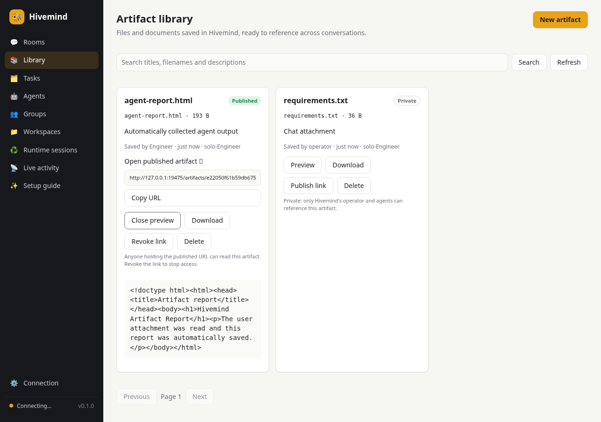
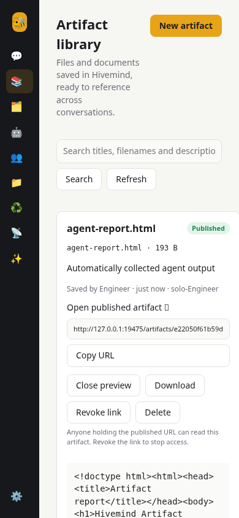
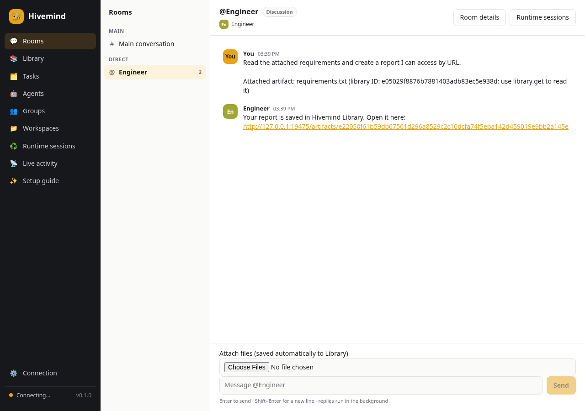
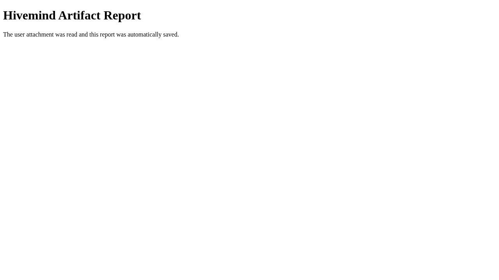

# Artifact Library validation

The real Hivemind backend and React UI were exercised with Chromium. A scripted Pi RPC fixture read the uploaded artifact using `library.get`, wrote an HTML deliverable, received its automatically assigned Library ID, called `library.publish`, and returned the actual URL. This verifies the host/runtime integration; it is not a live model or OpenCode run.

Confirmed:

- A chat attachment is copied into the private Library before its message is sent.
- The agent receives and reads the assigned ID through its host tool.
- A generated file is automatically saved and the agent gets its Library ID before finalizing.
- The published URL is clickable in chat and opens the report in a fresh browser session.
- Desktop and 390-pixel mobile pages show the Library and previews without horizontal overflow.
- No browser console errors or uncaught exceptions were observed.

Automated checks: Rust unit/API/coordination tests, `cargo clippy --all-targets -- -D warnings`, frontend TypeScript/production build, and Playwright first-run + Library lifecycle tests. Backend coverage includes immutable copies, persistence across reopening, search, automatic versioning/deduplication, task worktree imports, observer write/publish denial, workspace confinement, authentication, sandboxed content responses, URL rotation/revocation and deletion.

## Library

## Agent reference and directly accessible report

