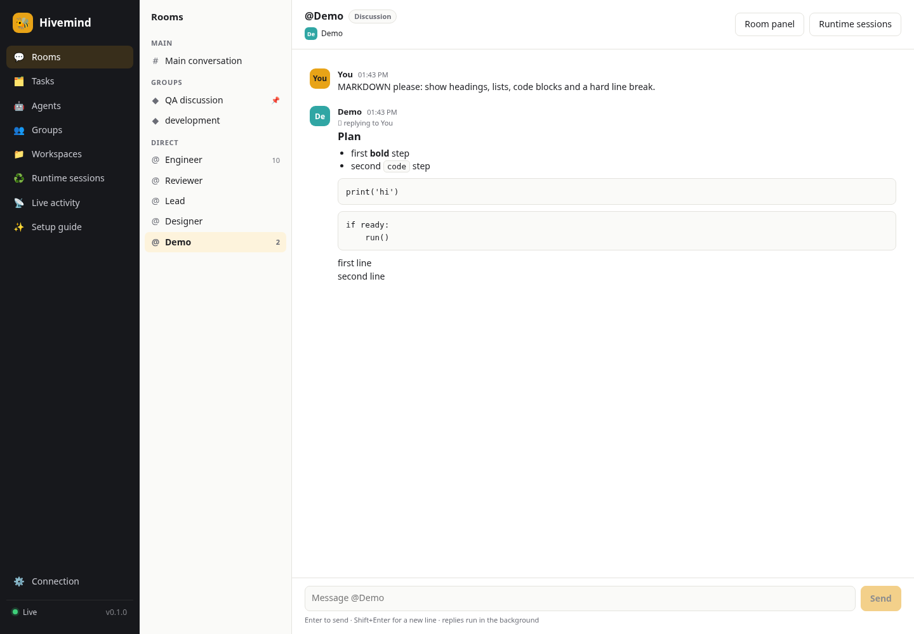
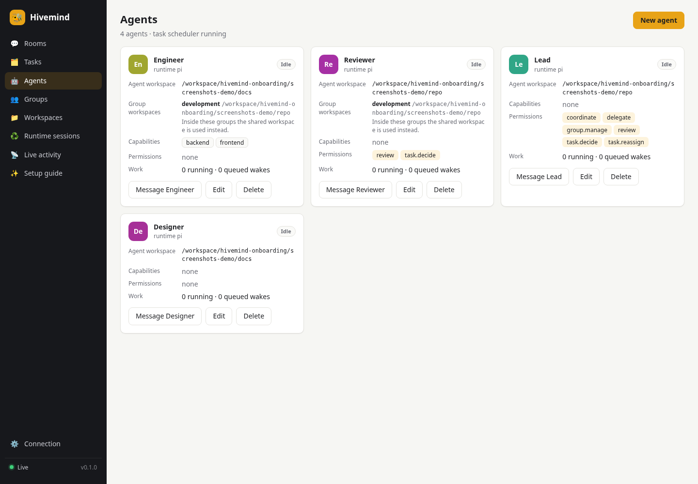
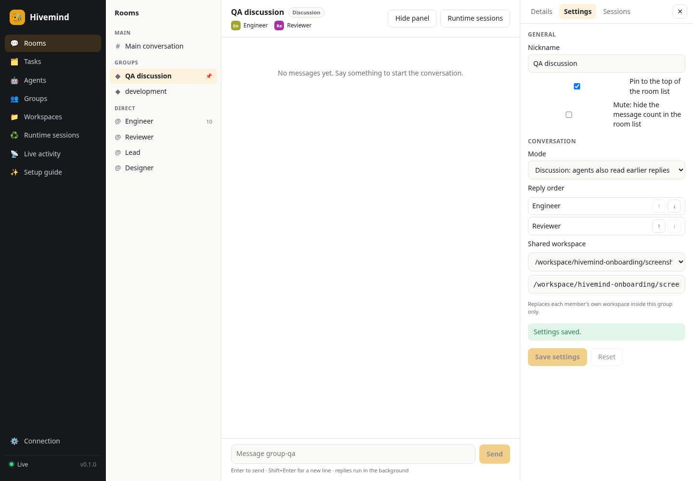
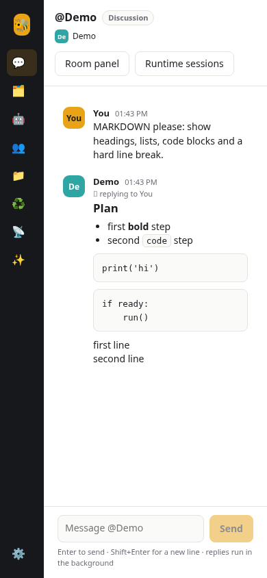

# PR #33 verification screenshots

These screenshots were captured from the running Hivemind backend and frontend with the follow-up fixes in this PR. Chromium/Playwright exercised the UI at 1440 × 1000 and 390 × 844. The runtime is the scripted Pi fixture; no live provider calls were made.

Verified behavior:

- Markdown headings, lists, fenced and indented code, and hard line breaks render correctly.
- An agent workspace changed through room settings survives creating another agent and reloading the page.
- Settings save for a group whose ID starts with `group-`.
- Details and runtime sessions remain accessible.
- The live connection indicator reflects an already connected WebSocket, and mobile header controls fit the viewport.
- No browser warnings, page errors, or framework overlays occurred in the screenshot flow.

Validation: 255 Rust tests, 14 Markdown unit tests, 6 browser E2E tests, backend/frontend builds, formatting, and Clippy passed. The browser E2E suite was rerun after the connection-status fix; the subsequent mobile layout change passed targeted button bounds/navigation checks and the frontend build.

## Desktop chat

## Workspace preserved after agent creation

## Saved settings for a prefixed group ID

## Mobile chat

