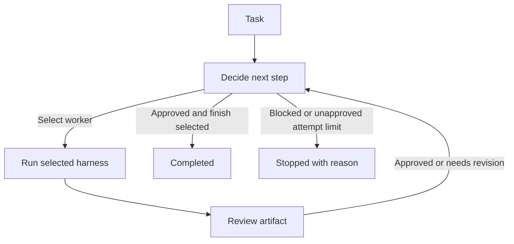

# Hivemind: A LangGraph-Powered Workflow Orchestrator

**Hivemind** is a TypeScript terminal application built on [LangGraph](https://langchain.com/langgraph) that orchestrates multi-agent workflows through a decide → work → review loop.

## Core Concept

A task flows through three roles:

1. **Router** — selects the next worker (via a rule or model-based decision)
2. **Worker** — executes a harness (e.g., OpenCode, Pi, a custom command) to produce an artifact
3. **Reviewer** — checks the artifact and approves, requests revisions, or blocks the run

The loop continues until the artifact is approved or the attempt limit is reached.

## Key Features

- **Interactive TUI** — a terminal UI for watching progress, browsing history, and editing configuration
- **Scriptable CLI** — run tasks non-interactively with `--task "..."` and `--config ...`
- **Harness system** — built-in adapters for OpenCode, Pi, OpenAI-compatible APIs, command-line programs, and a demo mode
- **Config-driven** — agent roles, harness registrations, router type, and loop limits are defined in JSON or TOML
- **Revision support** — workers can revise their output based on reviewer feedback
- **Web console** — an optional Next.js + Elysia API interface for live progress tracking

## Typical Workflow



## Getting Started

```sh
# Install
npm ci

# Run the demo (offline, no API keys required)
npm run demo

# Run a task from the CLI
npm run cli -- --task "Write a project introduction"

# Launch the interactive TUI
npm run tui
```

## Configuration

Configuration files define:
- **Harnesses** — which CLI adapters to use (opencode, pi, command, openai-compatible, demo)
- **Agents** — workers, reviewers, and a router, each tied to a harness
- **Router** — rule-based (selects first worker) or model-based
- **Limits** — max attempts, timeouts, and output size caps

See the `examples/` directory for starter configs, or run `npm run cli -- --config examples/demo.json --show-config` to inspect the effective setup.