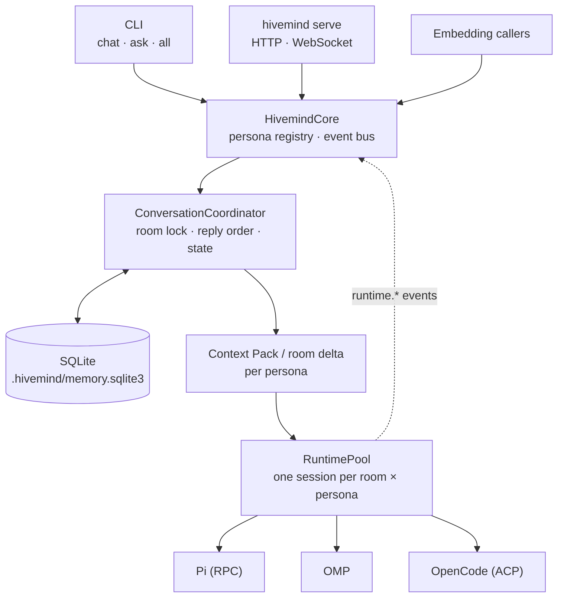

# Architecture

## Where things run

- `serve`, `ask`, `all`, and `chat` all build a library `HivemindCore`. It holds the ordered persona registry, one SQLite-backed memory service, one durable conversation coordinator, a per-instance runtime pool, and a bounded process-local event bus.
- `chat` uses one core for the whole session; `ask` and `all` build a new core for each command.
- The core resolves a target (main, solo, group) into room identity, mode, participants, roles, and reply order. Participants are checked before any runtime starts.
- Room turns are serialized by a room lock. Broadcast runs participants concurrently; discussion runs them in order and includes the earlier replies from the same turn.

## Session lifecycle

- Each agent instance is identified by its structured **(room, persona)** IDs. A session can last across turns for that instance but is never shared between rooms or personas.
- The first prompt of a session carries the full **Context Pack**. Later turns send only a **room delta**, and memory-tool follow-ups send only the tool result.
- At a turn boundary, a session rotates (`runtime.rotated`) if its context reached `context.runtime_rotate_tokens` or its next delta can't be built.
- If a prompt goes silent for `runtime.prompt_timeout_secs` (any streamed text, tool, or status event resets the window, so a long-running active agent is not cut off), Hivemind cancels it, drops the session, closes its runtime epoch, and **does not retry**. The next turn starts a fresh session rebuilt from room history. Any other runtime failure also drops the session without a retry and is reported as an error attributed to that agent.
- A session closes after `runtime.idle_timeout_secs` without use and stops on core shutdown. No session is left running after exit.
- **Pi** runs in RPC mode with `--no-session` and keeps its in-process context between prompts. Hivemind waits for `agent_settled` and returns the text blocks from the latest assistant `message_end`.
- **OpenCode** runs `opencode acp` over stdio, one child per room + persona.

## Storage

`.hivemind/memory.sqlite3` sits next to the config file and holds rooms, turns, messages, scoped memory with FTS5, runtime epochs, and group state. It runs in WAL mode with `synchronous=NORMAL`: an application crash loses nothing, while power loss or an OS crash can drop the last few committed turns (the database is never corrupted). A turn writes only its own new messages, and searches are scoped to one room or memory scope inside FTS5. `.hivemind/context/` holds only room turn-lock files and any legacy JSON history not yet migrated.

Access decisions are audited separately in `.hivemind/access.sqlite3` (see [Access Control](Access-Control)). The issue backlog, when the council has run, is `.hivemind/issues.sqlite3` (see [Issues](Issues)). Details of the storage engine are on [Backend Efficiency](Backend-Efficiency).

## Identity encoding and legacy migration

- At storage and public-protocol boundaries, the (room, persona) identity is written as `agent_instance_id` in the versioned **`ai1` length-prefixed** encoding. It round-trips without guessing where one ID ends and the next begins.
- **Legacy JSON room history** is imported exactly once: every turn and the room snapshot are written to SQLite, and the JSON file is removed only after that succeeds.
- **Legacy private-memory rows** keep `scope_type = 'agent_instance'` and stay opaque to typed callers. New rows use `agent_instance_v1` with `ai1`.
- **Legacy runtime epochs** keep identity version `0` and are never returned or closed through typed lookup. New epochs use version `1`.
- Hivemind **never splits** an old `room/persona` string on the delimiter, since IDs may contain `/`.

## Embedding

The library's `core`, `events`, `conversation`, `config`, `runtime`, and `memory` modules expose the kernel for embedding. `HivemindCore::events().subscribe()` returns an independent, bounded Tokio broadcast receiver of typed `DomainEvent`s with process-local sequence, ID, and timestamp metadata. Slow consumers must handle `RecvError::Lagged`, for example by refreshing from authoritative state.

## Source layout

| Path | Contents |
| --- | --- |
| `src/core*` | `HivemindCore`, persona registry, shutdown |
| `src/conversation/` | Turn coordinator, room store, state directives, memory tool bridge |
| `src/runtime/` | `HarnessSession` adapters for Pi, OMP, OpenCode and the runtime pool |
| `src/memory/` | SQLite store, FTS5 retrieval, memory policy |
| `src/coordination/` | Autonomous task scheduler, planning, messaging |
| `src/access.rs` | Roles, permissions, audit log |
| `src/shared_workspace.rs` | Workspace tools and config rewriting |
| `src/api/` | Axum HTTP and WebSocket server |
| `src/cli/`, `src/commands.rs` | Command-line interface |
| `src/events.rs` | Typed domain events and the event bus |
